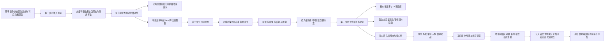

## 信息表

| 字段 | 内容 |
| --- | --- |
| 主题 | 健身新手的饮食完全手册（增肌减脂饮食：摄入总量、日内分配、食物来源与配餐、专题与常见错误） |
| 类型 | 讲座·网课 |
| 讲者 | 好人松松 |
| 平台 | 哔哩哔哩（B站） |
| 时长 | 1 小时 50 分 45 秒 |
| 章节数 | 5（开场 + 第一部分 摄入总量 + 第二部分 日内分配 + 第三部分 食物来源与配餐 + 第四部分 专题与常见错误） |
| 转写方式 | 本地 SenseVoice int8 + silero VAD |
| 素材来源 | B站 BV1yX4y1q7LP |

## 内容流程图

## 分段要点

### 0:00 开场

- 用网课形式一口气讲完增肌减脂的健身饮食全部内容，课纲分四部分：摄入总量、日内分配、食物来源与配餐、专题与常见错误。
- 一句话概括健身饮食：**不是去管理具体的食物，而是管理食物背后的碳水、蛋白质和脂肪**。
- 这个管理分两个方面：**碳蛋脂的摄入总量**（第一节）与**碳蛋脂的日内分配**（第二节），总量和分配就是健身饮食的基本逻辑。
- 第三节讲有哪些碳蛋脂食物来源、怎么配餐；第四节讲专题问题与新手常见饮食错误。
- 重要内容的无字幕截图集中在视频最后，不用边看边截图做笔记；可用章节跳转、倍速播放。

### 2:10 第一部分：摄入总量

- 热量平衡（盈余/缺口）理论本身正确，但在饮食实践里用不上，原因是**你根本不知道自己体重不增不减的热量平衡点是多少**。
  - 基础代谢的多个估算公式，同一个人代入后结果相差百分之几到百分之十几。
  - 活动消耗的估算更不靠谱：三种常见公式都是靠文字自我判断、对号入座，主观粗糙；同一个人按三种公式算出 0.55、0.78、0.98 三个系数，高低相差快一倍。
  - 与实测对比：长期记录饮食者维持 65 公斤时每天约 2200 大卡，扣掉食物热效应约 200 大卡，真实的基础代谢加活动消耗约 2000 大卡；而网上公式估算结果**最少高出一成多、最多高出四成多**。照此增减一两成热量，想要的干净增肌会变成脏增肌，想要的减脂会变成体重不掉甚至增加。
- 算热量还是算碳蛋脂？**答案是算碳蛋脂**：设定好碳蛋脂就等于设定好了热量，一举两得；反过来设定热量却不能得知碳蛋脂的量（同样 2000 大卡可以有无数种碳蛋脂比例，效果差别很大）。
- 正解是**按经验化配额试吃并调整**。
  - "吃几克"不是真实重量，而是每公斤体重的日摄入量（吃几倍体重）：70 公斤的人吃碳水 4 克，即每天 280 克碳水。
  - 配额表区分男女：**同体重同活动的女性，力量平衡点要低一两成**，所以女性的碳水和蛋白质配额相应降低。
  - 表也区分训练日与休息日。**训练日特指力量训练**：一个动作最多只能做十几次就做不动、需要休息两三分钟才能做下一组；帕梅拉、跳操、团课、拿小哑铃做几百次都不算。
  - **休息日（纯休息或只做有氧）要明显降低碳水**，蛋白质和脂肪大体不变。
  - BMI 大于 28 的肥胖群体，**减脂起始配额要再降低**：多出来的体重是脂肪，不增加器官也不增加肌肉，单位体重的基础代谢比别人低；这类人先做减脂，不用做增肌。
- 调整办法：**以碳水的增减作为热量变量，尺度约 0.5 克碳水（对 70 公斤的人相当于训练日多吃约 100 多克米饭）**，蛋白质和脂肪可以略加但不能再往下调，建议接近固定。
  - 增肌：先试吃两周，体重能增加约 1% 就不用调整；两周涨 2%–3% 说明盈余太多、变成脏增肌，降碳水；几乎不涨说明盈余不够，加碳水。
  - 减脂：先试吃两周，体重能降低约 2% 就不用调整；不掉说明缺口太小，降碳水；两周掉 3%–4% 说明缺口太大，要加碳水——**掉太快会有更多肌肉流失，而减脂的目的是让肌肉好看**。
  - **减脂要做碳水递减**（表里写了训练日碳水的初期和末期配额），男性训练日碳水 2.5 克左右、女性 2 克左右的中间阶段能待很久、让体重稳定下降；**起码要两周体重完全不动才考虑降碳水**，不要几天就降到末期配额。这是减脂和增肌的一个区别。
  - 体重增减一两公斤不必重算配额（按每公斤体重日摄入量算，总量也就是几克的差别，误差和每日波动都远不止这点）；**减脂掉 5 到 10 公斤后可以重算一次**。
- 判断标准为什么用体重而不是别的：**只能以两周为周期看体重变化**。
  - 影响体重的三个因素：一是食物潴留排空的程度（所谓空腹并非真空腹）；二是碳水与水盐浓度快速改变人体含水量（**1 克肌糖原能吸收 3 克水**，肌糖原 300 克的变化就能带来 900 克水分变化；运动员赛前停盐灌水几天能掉几公斤）；三是肌肉和脂肪量的真实变化，但极为缓慢（增肌半年 2 公斤 ≈ 每天 10 克；减脂半年 5 公斤 ≈ 每天 30 克）。
  - 天天对比体重能增减 1 公斤之多，其中肌肉增量最多 10 克（约 1%）、脂肪减量最多 30 克（约 3%），**从这个波动里根本判断不出肌肉和脂肪的变化**：短期波动（食物潴留、水盐）会轻易掩盖肌肉脂肪的持续变化趋势。
- 怎么算自己的碳蛋脂摄入：
  - 包装食品看营养表：每 100 克含多少克碳蛋脂；NRV 那一栏对健身者没有意义（不分男女、不分体重、不分普通人和健身者，按 14 亿人统一需求）。
  - 非包装食品：先知道自己吃了多少重量（买个二三十元的厨房秤，常吃的食物各称几次就有数，不必天天顿顿称），再用薄荷健康 APP 计算。
  - 薄荷必须先输入自定义总热量，才能把热量分配给碳蛋脂；所以要**先把碳蛋脂按每克碳水、蛋白质、脂肪 4/4/9 大卡求和算出总热量**。例：65 公斤增肌配额设碳水 4 倍、蛋白质 2 倍、脂肪 1 倍体重，总热量 2145 大卡。
  - 主食要分清生熟（生米到干饭到稀饭碳水率越来越低，**算生的更准，算熟的也完全没有问题**）；不分生熟会吃出差几倍的错误碳水配额。
  - 肉类不要细分品种和部位，按瘦肉自定义一个数据即可（猪肉脂肪率略被低估、鱼虾蛋白率略被高估，不影响大局）；薄荷里部分肉类数据本身是错的（如卤鸡腿可食部分蛋白率 15.3% 是错的，生鸡腿约 20%，卤熟因脱水更高）。
  - 脂肪计算不难：鸡蛋、牛奶、包装食品的脂肪量是固定的；瘦肉的脂肪量靠称重估重几次形成认知；**唯一全靠主观估计的是菜里的油——清淡炒菜一人份记 5 克油，重口炒菜一人份记 10 克油**（指直接用油、一人份吃下的量，不含瘦肉自带脂肪）。
  - 蔬菜大多可以忽略，只计根茎类（土豆、芋头、山药等其实是富含淀粉的主食）和豆类、蒜苔、胡萝卜等碳水率较高的；实在苛刻就每天加 10 克碳水。**水果则一定要纳入碳水管理**（碳水率高、容易吃多、形式是纯糖）。
  - **混合食物不能用薄荷数据**：牛肉面碳水率 13% 是按整碗的重量做分母，熟面条实际约 23%，会低估近一倍；鱼香肉丝蛋白率 11% 也是按整份菜做分母，熟瘦肉应有 25% 左右。正确做法是用食材本体的数据乘食材重量。
  - 另一种办法是自建 Excel 表：把常吃食物查好数据后按"份"写进表格，只输入份数就自动求和出碳蛋脂总量和体重倍数；食谱稳定的人比薄荷更快，还能改份数试算。
- 新手一定要经历一两周称重和计算来建立**饮食基线**：知道每餐每天吃多少主食、多少瘦肉、多少鸡蛋牛奶、多少零食。例：力量训练者蛋白质基线起码 1.5 到 2 克，而不计算的新手普遍只有 0.5 到 1 克，无论增肌减脂都会影响进步。

### 37:26 第二部分：日内分配

- 总量定好之后还要分餐，根本原因是**要人为操纵胰岛素来趋利避害**。
- 胰岛素是能把血液里的葡萄糖和氨基酸转运进肌肉和脂肪组织的合成代谢激素，既能增肌也能增脂，而且是其中最容易自己操纵升降的。
- **力量训练破坏肌纤维之后，配合高胰岛素会增肌增脂**：所以练后餐用全天约四成碳水加 30 到 50 克蛋白质、少吃不吃蔬菜来故意升高胰岛素。减脂期练后照样要吃一个大练后餐，用这点增肌去抵消其他时候的分解代谢造成的肌肉损失；增肌期更要把握练后窗口。
- **没有力量训练破坏肌纤维时，高胰岛素只会增脂**：所以非练后的其他时间和休息日，各餐碳水量要比训练日练后餐少一些，有条件的还要多吃先吃蔬菜，保持胰岛素相对稳定。
- 原理：碳水刺激胰岛素的能力最强、蛋白质一般、脂肪很弱，而饮食里碳水无论克数还是热量占比都远高于蛋白质和脂肪，所以**管胰岛素主要就是管碳水**；蔬菜里的纤维素与胰岛素负相关，**约 2 克纤维素（约 100 克蔬菜）就能让胰岛素相差三成**，推测是纤维素降低胃排空速度、缓释消化。
- 日常饮食分四类：早饭、练前餐、练后餐、其他餐（午饭晚饭随训练时间可能属于其中之一）。蛋白质和脂肪"不严格"指日内分配可偏分摊也可偏集中，一般建议偏分摊。
  - 早饭：全天约两成碳水。
  - 练前餐：全天约两成碳水，蛋白质可吃可不吃，脂肪一般不吃；**时间在正式组开始前 10 到 30 分钟（到了健身房再吃都来得及）**，因为任何碳水吃下去就立即升血糖、半小时到 1 小时到高点；练前一小时吃则训练时血糖已回落到吃饭前水平，等于没吃；常选中高 GI 又方便的食物（馒头、面包、香蕉、葡萄干、蔗糖饮料）。
  - **练后餐是健身饮食里最重要的一顿饭**：全天约四成碳水加 30 到 50 克蛋白质、脂肪 20 克以内、蔬菜少吃不吃晚吃；**最好练完半小时就开始吃（是"最好"而非"必须"）**，不要因为玩手机、拍照、聊天、洗澡拖一两小时；形式可以是正餐（主食加瘦肉），时间紧就用便携快碳加蛋白粉的速配练后餐。
  - 其他餐：全天两成左右碳水，全天总量符合即可。
- 训练日按训练时间排分餐方案：早饭后练→早饭当练前餐（五六分饱）＋练完单独吃最大的练后餐，午晚饭是其他餐；午饭前练→午饭是练后餐（全天最大一次碳水），晚饭是其他餐；晚饭前练→晚饭是练后餐，午饭是其他餐；晚饭后练→晚饭当练前餐，晚上练后必须吃单独的、最大的练后餐。**很多人反着吃（午晚饭使劲吃米饭馒头、练完不敢吃碳水），胰岛素就反过来了**。
- **四种方案都是把 100% 的总量分到各餐，总量相同，区别只是因力量训练时间不同而分配不同**。视频里所有数字都只是大概参考，不是让你按克数吃饭。
- 减脂期训练日的分配原理相同，但**随碳水总配额递减，其他餐的两成碳水要逐渐少吃不吃**（比例大致从早饭 2:练前 2:练后 4:其他 2 变成 3:2:5），即多牺牲其他餐、少牺牲早饭练前练后的碳水，尤其是少牺牲练后餐。男性碳水递减到 2.5 克、女性递减到 2 克时，其他餐的碳水就可以基本不吃了。总碳水大量减少，各餐碳水的绝对量都在下降。
- 休息日：**不做故意集中，各餐碳蛋脂大概均摊**，保持胰岛素相对稳定以减少增脂；碳水总量是自然下降的（不吃练前那份碳水、练后大碳水降为常规一顿），增肌期约 2.5 到 3 克、减脂期约 1.5 到 2 克；蛋白质和脂肪总量可以大概不变。
- 碳水的日期变化：三分化训练时肩臂拆进胸背腿日、每天都练大部位，**不用考虑练后餐的日期变化**；四分化或五分化有单独的手臂肩部日时，该日练后餐的碳水可减少约三分之一。

### 56:20 第三部分：食物来源与配餐

- 碳水有两个属性：碳水率和分解为葡萄糖的速度。**碳水率与 GI 没有任何关系**（藕粉、粉条碳水率高但 GI 低；西瓜、南瓜、胡萝卜碳水率低但 GI 高）。
- GI 的定义：摄入 50 克碳水的食物后 120 分钟内血糖升高曲线下方的面积，以 50 克葡萄糖的曲线面积记为 100。**高 GI、低 GI 必须在碳水量完全相同的条件下比较**，脱离碳水量谈 GI 没有意义。
- 同一原料在不同烹饪方式下 GI 差别很大（生红薯中低、煮红薯已经是快碳、烤红薯特别高；煮燕麦米低、即食燕麦片高），所以**介绍 GI 必须标注烹饪方式**。
- 生活中大部分碳水都是高 GI，中 GI 不多，**据我所知低 GI 只有藕粉和粉条**（蔬菜牛奶也是低 GI，但不当作主食）。
- 碳水食物有明显饱腹感区别，**不是越高或越低越好，要按碳水配额和胃口选**：增肌期练后餐碳水量大、吃不下米饭时，可用米糕、青团、米粉、葡萄糖、旺仔小馒头等低饱腹感碳水；减脂期早饭配额少，可用燕麦片、燕麦麸等高饱腹感食物更扛饿。
- 脂肪是性激素的前提、脂溶性维生素 A、D、E、K 的吸收载体，**碳蛋脂不应该分好坏**，按大致合适的量吃就行。
  - 推荐方案：炒菜正常吃（清淡一人份 5 克油、重口一人份 10 克油，特别重油的刮一下再吃）＋鸡蛋牛奶正常吃（鸡蛋每天两三个、牛奶一两包）＋瘦肉里不可避免的微量脂肪，全天脂肪就大体合适（示例全天约 70 克，对一般体重男性很合适）。
  - 鸡蛋是蛋脂混合物、牛奶是碳蛋脂三者相当，**不是"干净的蛋白质"**：6 个鸡蛋或一升牛奶各占约 30 克脂肪，容易吃掉全天脂肪配额。
  - 少吃不吃：煎炸类（宽油炒鸡蛋能额外吸油二三十克，吃一个煎鸡蛋等于吃三四个炒菜）；肥肉、糖油混合物、坚果等**固体脂肪**——它们看不出有脂肪，所以会无意识吃多。一小块肥肉约 30 克脂肪等于 5 勺油；两根油条、两个蛋挞各约 30 克脂肪；一个小糕点近 40 克；两把坚果 40 多克。**脂肪摄入超标的人不是因为吃炒菜、鸡蛋牛奶，而是无意识吃了太多固体脂肪**；这些东西不要作为基础性食物，只能当偶尔的调节性食物。
  - 不必刻意追求"优质脂肪"：饱和、单不饱和、多不饱和脂肪酸各有生理功能、都是必需，各国推荐比例大多约 1:1:1；植物油和坚果其实类似（都以不饱和为主），按上面的正常吃法三种脂肪酸比例就恰好比较均等。
- 蛋白质：**主要来源只有瘦肉和蛋白粉**（几乎纯蛋白，附带碳水和脂肪很少）；力量训练者基础摄入量 1.5 到 2 克，喜欢吃肉的可以吃到 2 到 3 克，但对长肌肉已经溢出、只是提供热量。乳清蛋白粉从牛奶提纯，蛋白率一般 80% 以上。
  - 辅助来源是鸡蛋、牛奶、豆制品：蛋白率低（一个鸡蛋约 6 克、一包牛奶约 10 克、200 克豆腐约 12 克），而且**在提供蛋白质时会附赠差不多量的脂肪**（脂肪率和蛋白率旗鼓相当），做成主要来源就会蛋白质吃够的同时脂肪爆炸；除非只吃蛋清或脱脂牛奶。
  - **植物蛋白不必剔除**：评分方法是针对单一食物的极端假设（假设你一辈子只吃这一种），多种食物混合能互补限制性氨基酸；而且每天吃进的植物蛋白总量很少，就算打折计入也就少算 10 克 8 克，远小于允许的波动和计算误差。
- 配餐总原则：**先搞定蛋白质**（每餐 20 到 30 克以上，吃瘦肉起码 100 多克；没有瘦肉就用鸡蛋、牛奶或蛋白粉）→ 脂肪靠炒菜里的油、鸡蛋牛奶的脂肪和瘦肉微量肥肉就够了 → 碳水按该餐需要的量选纯碳水 → 肥肉和糖油混合物少吃不吃、最多浅尝。
  - 食堂早饭有瘦肉：先拿蛋白质（如去皮卤鸡腿两个约 30 克），再配纯碳水（大馒头／一碗中等面条／两碗稀饭，约 50 克碳水）；想把脂肪配额留给其他时候就吃得更低脂。
  - 食堂早饭没有瘦肉：用两个鸡蛋加一包牛奶凑够 20 来克蛋白质（同时也有二十来克脂肪），接下来就必须选馒头面条稀饭这类纯碳水，别选肉包子手抓饼，更不能吃油条麻团锅盔。
  - 宿舍早饭：碳水用燕麦片、燕麦麸、玉米粉、芝麻糊、藕粉等冲调，蛋白质用两包牛奶（会附带碳水和二十来克脂肪，谷物碳水要减量）或蛋白粉（不占脂肪配额）。
  - 午晚饭：先找瘦肉（卤牛肉、卤鸡腿、酸菜鱼、红烧鸡块、水煮肉片都算），量要吃到 100 来克；脂肪已经够了就不用再补；米饭馒头按该餐需要的碳水量吃；蔬菜按是否需要压制胰岛素决定多吃先吃还是少吃晚吃。
  - 在外聚餐、四川火锅、肯德基：同样是先找蛋白质（火锅里的牛肉、鱼片、毛肚、菌肝、黄喉都算瘦肉），脂肪来自菜里的油或火锅蘸料，肥肉和糖油混合物（肘子、红烧肉、五花肉、酥油饼、肥牛、午餐肉、炸酥肉、蛋挞）少吃不吃、最多浅尝，碳水按该餐需求安排（练后餐就是全天最大一次碳水）。
- 掌握这套路数，不管吃食堂、外卖还是在外聚餐，不管增肌还是减脂，都能完成合适的配餐。

### 81:47 第四部分：专题与常见错误

- 专题一 增肌与减脂的饮食区别：摄入总量上增肌远高于减脂，主要是碳水量差别很大，脂肪略有差别（但脂肪不容易算准，最好把握的其实是碳水）；日内分配上的区别是其他餐占的全天碳水比例不同，**少掉的碳水不是各餐等比例扣减，而是主要牺牲其他餐、少牺牲练后餐**（比例由 2:2:2:4 变为 3:0:2:5 这类），男性碳水总量降到 2.5 克、女性降到 2 克时就基本不吃其他餐。增肌期不能只吃三次碳水（总量大，很难完成碳水任务）；饱腹感选择上，增肌期可用低饱腹感碳水，减脂中后期改用燕麦麸、燕麦片、米饭等扛饿的。
- 专题二 饮料、水果等糖制品：糖分两类，**与果糖有关的糖**（果糖、果葡糖浆、蔗糖）和**与果糖无关的糖**（葡萄糖、麦芽糖）。
  - 果糖 GI 非常低（只有 23，因为 GI 测的是血糖即血里的葡萄糖，果糖吃进去只有少部分转化为葡萄糖），但**果糖有日摄入限量：不要经常性超过每天 30 到 50 克**，过量与肥胖、脂肪肝、高尿酸等健康问题有关。
  - 果糖摄入量按"果糖本身 + 果葡糖浆的大约一半 + 蔗糖的大约一半"计算。试算：两根全熟香蕉 60 克碳水含 30 克果糖，一瓶可乐 50 克碳水含 25 克，一袋不大的牛肉干近 40 克碳水含 20 克，加起来 75 克，一天就超标了。
  - 建议：既不要谈糖色变、追求无糖（连调味料和面包里几克蔗糖都怕没必要），也不要把糖当成"只要碳水不超标就随便吃"。**练后餐全靠可乐、冰棍、西瓜、香蕉提供碳水会果糖超标**，尤其不能把水果当成可完全替代主食的健康食品；把水果、糖饮料、高糖零食作为调节性食品，不作为碳水主要来源。
  - 葡萄糖和麦芽糖和主食一样会全部分解为葡萄糖，只是速度更快，不存在果糖那类限量问题，在添加剂里使用率也低（甜度低、价格贵）；唯一要注意的是不要一口气吃大量（练后加二三十克替代一部分主食就够，否则可能恶心头晕）。
- 专题三 补剂的选择：**把碳蛋脂管理做好，比吃各种补剂重要得多得多**。
  - 第一推荐乳清蛋白粉：方便易得、随时可吃，单位蛋白质的价格便宜（与猪肉鸡肉一个价位，比牛肉便宜得多），与其说是补剂不如说是储备性食物，吃多吃少、吃频繁吃偶尔，买了总不亏。
  - **注意区分蛋白粉和增肌粉**：增肌粉是少量蛋白粉加大量快碳混合而成，成本低得多但市价只比蛋白粉低一点，利润空间大，很多品牌极力诱导新手买。鉴别方法是看**英文大字和营养表**：乳清蛋白粉英文是 whey，去掉某部分是分离乳清蛋白（isolate 或 ISO），蛋白率高于 70%；增肌粉是 mass gainer，蛋白率低于 30%。**不要看电商商品名，也不要看外包装上的中文名**（有的品牌把增肌粉写成"乳清蛋白营养粉""复合蛋白粉"）。
  - 复合维生素矿物质：健身者吃水果蔬菜偏少，更容易缺乏，买便宜的就行（物料成本很低）。
  - 肌酸：能略微增加力量（有研究综述指出可增加 5% 的腿部力量和 8% 的深蹲力量），但这种幅度不容易被感知，因为日常力量波动都不止这点。用稳定摄入法最简单，练前练后或其他时间吃都行，目的是维持体内长期浓度；**减脂期不需要停用**，只有打比赛的运动员赛前为了脱水表现肌肉质感才停。警惕"肌酸能量粉"这类产品：营养成分表里碳水高达 69.5%、肌酸只有 17.6%，还把肌酸改成毫克表示法把数字扩大 1000 倍，实质是碳水里加了点肌酸。
  - 咖啡因：能略微增加力量和耐力，建议**每公斤体重 3 到 6 毫克、练前半小时到 1 小时摄入**，初次使用先用小剂量试；晚训一般不用。网上卖的高因咖啡数据往往不明确，建议问清含量或直接买标准化的咖啡因片。
  - 鱼油：宣传功效多，但还不是 A 类补剂（功能尚未被大量科研彻底实锤），因为不贵、即便没用也不会有害所以畅销；吃的是 DHA 和 EPA。**几乎不吃海鱼或坚果的人每天可吃 1.5 到 2 克 DHA+EPA**；比价要用 DHA 加 EPA 的重量除以价格，浓度高低无所谓。
  - 补剂领域里碳水因为太廉价，常被包装成"能量""营养矩阵"等词（肌酸能量粉、蛋白营养粉、复合蛋白粉），看到这些词就要看营养成分表里加了多少碳水。
- 专题四 被误会的食物：
  - 鸡蛋：蛋白质很少（蛋白蛋黄加起来只有约 6 克），蛋白和脂肪两者相当，**不能作为蛋白质的主要来源**（否则蛋白质吃够时脂肪也爆炸）；只吃蛋清虽排除了脂肪，但没有补贴价的话价格和吃牛肉差不多。
  - 牛奶：蛋白质也少（一包只有约 9 克，早饭要吃够 20 克得两个全蛋加一包牛奶），同样是碳蛋脂三者相当，不能作为主要蛋白质来源；除非愿意喝没有奶味的脱脂牛奶。
  - 粗粮（红薯、糙米、燕麦片等）：网上强调它 GI 更低、有利胰岛素稳定、饱腹感更好，**实际上粗粮普遍是中高 GI**（煮红薯、烤红薯、糙米饭、即食燕麦片实测 GI 与白米饭白馒头同一档；煮土豆、煮玉米稍低但也差不了多少），真正的低 GI 只有藕粉和粉条（GI 只有 30 多）；练后餐本来就要吃高 GI 碳水来提高胰岛素，一边安排全天最大碳水一边找低 GI 碳水是自相矛盾；压制胰岛素最现实的办法是管理该餐碳水量和多先吃蔬菜；粗粮一般只在减脂中后期为扛饿才用一部分，白米饭的饱腹感其实也相当可以。
- 常见错误一 **食物决定论**：把健身饮食理解成吃特定的"健康食物"（红薯、燕麦、糙米饭、鸡胸、酸奶、西兰花、零糖零脂零添加等）就能增肌减脂。恰恰是搞精致配餐的人反而搞不清碳蛋脂的总量和分配，那些全网最火的所谓健康饮食教程里碳蛋脂严重不足。**健身饮食与具体食物无关**，关心食物是为了关心它的碳蛋脂率，目的是让总量和分配正确。
- 常见错误二 **热量决定论**：只讲热量不讲碳蛋脂（同一热量以不同比例碳蛋脂构成，效果差很大）；而且他们所谓管热量只是看每 100 克食物的大卡数字高低来排序（藕粉热量是土豆的四五倍就说不能吃），**脱离食物重量根本不知道自己吃了多少热量**（藕粉是脱水干粉、冲水后热量大降；土豆晒干后热量大增）。**健身饮食是定碳蛋脂，不是定热量**，定了碳蛋脂顺便就定了热量。
- 常见错误三 **模糊地按感觉吃饭**：只知道"增肌多吃、减脂少吃、多吃蛋白质"这类正确的废话，不知道往什么量去吃、怎么做日内分配。**要通过一两周称重和规划建立正确的饮食基线**（查食物碳蛋脂率、弄清食物重量、称几次就能目测），之后就不需要天天计算；每天舍得一两小时锻炼，却不愿每天花 10 分钟规划饮食一两周，才是丢了西瓜捡了芝麻。
- 结尾：主页有重点内容的汇总截图和问题回查索引，可发私信截图自动获取。

## 逐字稿

### 0:00 开场

恭喜你在首页刷到这个好人视频。
这期讲增肌减脂怎么做饮食？
先要感谢各位好人观众的投币支持，把我们上一课讲训练的视频刷到了全站第35名。
再上一个讲减脂的视频，刷到了全站第30名。
这个视频我们还是用网课形式，一口气讲完增肌减脂的健身饮食的全部内容。
战放也曾联系过我，想把这种视频改成付费课来推流。
但我觉得我刚来不久就开始卖课有点不妥。
所以大家点赞投币，支持一下up主就好了。
闲视频长的可以先收藏以后再慢慢看。
嫌拉进度条麻烦的，可以点屏幕左下角的章节跳转。
嫌我说话慢的可以点倍速播放。
另外呢在金课图中也不用截图和做笔记。
我会把重要内容的无字幕截图统一放在视频的最后，你打包带走就行了，所以一定要看到最后哦。
这是我们的课纲。
我待在画面的右下角我给你讲解。
如果只能用一句话概括健身饮食，我会说健身饮食不是去管理具体的食物。
而是管理食物背后的碳水、蛋白质和脂肪。
这个管理又分为两个方面。
第一方面，我们在第一节讲碳蛋脂的摄入总量。
就是男女增肌减脂，训练日休息日该吃多少总量。
第二个方面，我们在第二节讲碳蛋脂的日内分配。
就是我们在设定呢既定的碳蛋脂总量之后。
这个总量在这一天里的各餐该怎么分配？
总量和分配，这两点就是健身饮食的基本逻辑了。
接着我们在第三讲讲食物的来源与配餐方法。
虽然我们管理的是碳蛋脂的摄入总量和日内分配。
但我们终究是要用各式各样的食物去配餐，组合出各餐和全天的量。
所以我们得在第三讲。
给大家科普生活中有哪些碳水、蛋白质、脂肪食物的来源。
以及怎样配餐才能方便的。
得出我们需要的量。
最后一节我们再单讲一些大家关心的专题问题。
以及分析新手常见的饮食错误。
这就是我们的课程大纲。

### 2:10 第一部分：摄入总量

下面我们就来讲第一节。
碳蛋脂的摄入总量。
我们来讲男性女性增肌减脂训练日和休息日到底该吃多少碳蛋脂合适。
首先我们要讲热量的平衡，盈余缺口理论。
你可能早就听人讲过了。
教大家算基础代谢，算活动消耗。
加起来之后再上浮下调多少热量来作为你。
增肌减脂的应吃热量。
但我们这里要讲的是。
这个理论本身正确，但在你的饮食实践里是用不上的。
你不要试图去算出这套东西。
下面我们来讲为什么。
这是我们的热量平衡公式。
左边的热量摄入就是我们吃的食物热量。
食物热量等于食物里每克碳蛋脂。
分别按449大卡求和。
比如我们看到这包牛奶的营养表。
它的热量就是等于每克碳蛋脂乘以449大卡来求和得到的。
由此，我们顺便引出一个新手常见的困惑。
就是我们到底该算热量还是算碳蛋脂呢？
答案是算碳蛋脂。
原因很简单。
从食物热量的计算公式就可以看出，只要我们设定好了碳蛋脂。
就设定好了食物热量。
一举两得。
但反过来，我们设定一个食物热量，却不能据此得知碳蛋脂的量。
一个既定的热量可以有无数种。
碳蛋脂来组合出来。
比如同样是2000大卡的热量。
用这些不同比例的碳蛋脂吃饭的效果差别很大。
所以我们一定是管理碳蛋脂的量，而不是管理热量。
继续讲热量平衡公式。
右边的热量消耗了是三方面，一是基础代谢，就是人体在完全浸息，没有任何活动状态时维持身体运转所需要的热量，就好比手机在熄屏时也是要耗电的一样。
第二种热量消耗是活动消耗，就是我们一切。
走入骑车运动劳动。
等一切肢体活动导致的热量消耗，这个很好理解。
第三种热量消耗叫食物热效应。
就是科研界观察到，只要你吃下一个食物，你就会对外增加散热。
如果你不吃这个食物。
你就不会有这笔额外的散热。
称为食物热效应。
碳水和脂肪的食物热因是每吃100大卡。
会散发大约5大卡，也就是5%的热量。
而蛋白质的食物热效应很厉害。
每次100大卡会散发高达30大卡，也就是30%的热量。
我们说每克碳蛋脂本来热量是449大卡。
但如果你把食物热效应移动到左边来，从食物热量里扣减的话。
碳蛋脂的到手热量。
就会变成这样一个更低的数字。
所以说。
如果我们的碳蛋脂用的是最普遍的每克449大卡这个数字。
背后的含义是。
此时的热量消耗是要包括食物热效应的。
不能省阅。
如果我们的碳蛋脂只用的是这个更低的数字。
背后的含义就是我们已经把食物要印。
移动到左边来扣减掉了。
热量消耗这边就不用考虑食物热效应了。
那么什么是热量的平衡盈余缺口理论呢？
如果热量摄入和热量消耗相等，体重就会不增不减，叫做热量平衡点。
增肌需要在体重不变的热量平衡点上多吃一两成，形成热量盈余，使你的体重能够增加，减脂需要在体重不变的热量平衡点上少吃一两成，形成热量缺口，使你的体重能够下降。
这些都是老生常谈的内容呢。
那为什么我要说这个理论在大家的饮食实践里其实是用不上的呢？
原因就是其实你根本不知道自己体重不增不减的热量平衡点。
到底是多少打卡？
我现在问你，你体重不变的时际平均每天吃多少大卡呢？
你会说不知道。
毕竟你以前没有坚持做过饮食计算。
只有那些极少数坚持饮食计算的人。
才知道自己吃多少热量就会体重不变。
这是我曾经做过的饮食的一段记录。
在体重稳定在65公斤的几个月里。
用每克碳蛋脂的热量分别乘以49大卡来求和。
结果是平均每天吃2200。
这就是我的热量平衡点。
那么我确实可以在这个数字的基础上多吃或少吃一两成来做增肌减脂。
不行。
因为你没有像我这样做过长期的饮食记录。
所以你就不知道自己的热量平衡点到底是多少打卡。
当然有人会说。
我可以临时抱佛脚。
用网上说的那些公式来估算我的技术代谢，估算我的活动消耗。
加起来不就是我的体重不变的热量平衡点了吗？
这是不对的。
因为这样估算出来的热量平衡点是非常不可靠的。
我们先来说基础代谢的估算。
科研界确实提出过许多估算公式。
办法是先用实验设备实际测出许多受试者的技术代谢。
再结合他们的体重、身高、年龄等指标。
提出一个拟合公式。
使得受试者的指标带入这个公式后和实测结果。
比较接近。
科研界提出的基础代谢的估算公式，我大概整理了一些。
W是体重weight。
H是身高heit。
age是年龄age。
其中，体重是影响结果的最大因素。
取得公式就用体重来算。
由于研究者提出的估算公式不同，同一个人代入不同公式的。
结果也有所差异。
我们现在以一男一女来代入这些公式。
以最低估计值为基准。
其他估计值与之相差了百分之几到百10%几不等。
我们不知道哪个结果最接近真实。
但要知道。
热量平衡理论要求做增肌减脂是比热量平衡点增加一两成热量就可以了。
而我们的基础代写的基估算公式的浮动就快有。
这么高的比例了。
所以说，基础代谢的估算公式对我们的意义。
还是比较有限的。
接着是热量消耗的第二项内容，也就是活动消耗的估算公式。
这玩意儿的估计准确性就是离谱他妈给离谱开门，离谱到家了。
我这里放了网上最常见的三种活动消耗的估计公式，大家可以看看。
活动消耗的估算不是像基础代谢估算那样，让你去代入某个客观的数字去计算。
而是写了一堆文字，请你去自我判断对号入座。
非常的主观和粗糙。
第一种是让你按每周运动的次数来估计活动消耗。
这从逻辑上就说的不合理。
因为我们的活动消耗又不止运动。
运动之外，还有走动、干活等许多日常活动。
就算退一步说，只看运动。
但像他这样，不分运动的时长、强度、类型。
只要每周的运动次数相同，就视为人体的活动消耗相同。
显然不同。
第二种是按职业分类来估计活动消耗，从逻辑上说也不能自洽。
我们姑且就算默认同一行业的人，他们上班过程的热量消耗是完全相同的。
但在职业活动之外，大家还有各自的运动安排。
有的人不运动，有的人爱运动。
这肯定会造成明显的差异。
按他这个标准。
你们全校所有学生，不管是宅男还是运动狂。
大家的活动消耗都是一样的。
理由是你们的职业都是学生，所以你们的活动消耗就是相同。
第三种是按照你的活动程度来估计。
他的措辞就比较模糊。
比如说9座是要选这档。
常做就要选这档。
那久座和长座的区别是什么呢？
我该选哪个呢？
又比如说我不是一个体力劳动者。
所以似乎我应该选无体力劳动这档。
但同时我又是一个常坐但有时站立走动的人。
我又该选哪一档呢？
所以我说啊网上这些活动消耗的。
及公示。
你要认真推敲一下，就会发现没有一个看起来有多么靠谱。
对我来说。
按第一个公式。
我每周健身3到5次，所以活动消耗的系数应该是0.55。
按第二个公式。
我是个学生。
的系数应该是。
0.78。
按第三个公式。
我会写。
常做。
有时站立走动。
外加每周健身3到5次。
所以系数加起来应该有0.98。
那么这三个公式给了我三个相差很大的结果。
高低之间相差快一倍了。
我该信哪个呢？
下面。
我再拿自己饮食记录里得到的靠谱的热量平衡点来和网上公式估算得出的热量平衡点对比一下，看看能相差多少。
前面提到过，我是长期记录饮食的，体重不增不减，维持65公斤的时候。
食物热量按每克碳蛋脂49大卡计算是2200大卡。
按碳水和脂肪5%，蛋白质30%。
求出实物热销E大约是200大卡。
因此，我真实的基础代谢加活动消耗。
应该是2000大卡。
接着我再看用网上公式估算出来的结果。
在基础代谢部分。
众多估算公式里，我用的是薄荷健康APP里内置的算法。
结果是这么多。
在活动消耗部分。
刚才列出的三种估计公式，我按照我的情况去对号入座，取出了不同的系数。
得到的结果是这些。
最后我们再把估计的基础代谢和估计的活动消耗求和。
结果全部高于我自己的实测结果。
最少的高出一成多，最多的高出4成多。
假如我信以为真，用这些高估的结果去增减一两成热量，做增肌和减脂。
结果就是我想要的干净增肌会变成脏增肌。我想要的减脂。
会变成体重不掉。
甚至会有所增加。
这也证明了这些网上的估计公式是不靠谱的。
好了，我费了这么多时间来讲这些，就是想告诉大家，热量的平衡盈余缺口理论本身没有问题。
但他对在座各位没有用，因为你们没有长期记录过饮食。
你都不知道自己的热量平衡点是多少，那你凭什么在此基础上去做上浮下调？
来作为增肌减脂的应吃热量呢。
讲了什么是不对的，再来讲什么是对的。
实际上，健身饮食到底该吃多少总量，是直接按经验化配额试吃并调整就能确定了。
这就是我们健身饮食里最重要的阵题了。
所谓经验化配额，就是长期以往的健身实践和运动科学总结出来的一套饮食量。
对于大多数人来说，按此操作就能。
快速的试探出自己需要的热量、盈余或热量缺口。
你去问一个健身运动员，你的基础代价是多少？你的活动消耗是多少？他会说我不知道。
但他一定知道自己按某个碳蛋脂配合开吃，就能开始增肌或减脂。
我们实践上就是这么做的。
这就叫做按经验化配额试吃并调整。
下面我们来具体解释。
首先，健身饮食里说的吃几克并不是真实的只几克的重量。
而是指每公斤体重的日摄入量。
或者叫做吃几倍体重。
比如吃碳水4克，或者说吃碳水4倍体重。
是指70公斤的人每天吃70乘以4等于280克碳水。
表里的数字区分了男女。
这是因为同体重同活动的女性和男性相比，力量的平衡点要低一两成。
就说女生不需要吃那么多，就能同样的进行增肌减脂了。
所以我们对女性的碳水和蛋白质摄入降低一些。
这个蛋白质摄入量对女性是够的。
女性的肌肉量相对于体重的占比要比男性低得多。
他们对蛋白质的需求量就要比男性低一些。
表里的数字也区分了训练日和休息日，训练特质力量训练不是指有氧。
力量训练就是一个动作，你最多只能做十都次就做不动了，需要休息两三分钟才能做。下一组叫力量训练。
什么帕梅拉、跳操、团克等都不是力量训练。
哪怕让你拿个小哑铃小钢铃片来做，也不叫力量训练。
因为这些动作你能一次连续做几十分钟，几百次重复都不休息。
他就不是力量训练，，而是一种进行热量消耗的有氧活动。
这个表里的训练日是特指力量训练。
休息日则是指。
纯休息或者只做有氧。
休息日里，我们没有多少肌糖原消耗。
也没有做高胰岛素去增肌的窗口期。
所以休息日建议大家要明显降低碳水的摄入量。
蛋白质和脂肪则可以大体不变。
多少一点也没有关系。
另外，提醒大体上肥胖群体。
比如BMI大于28的。
你的减脂的起始配额要降低到这个数字。
为什么大体重要降低骑实配额呢？
因为基础代谢主要是靠器官，其次是靠肌肉，而不是靠脂肪。
大体重者，他多出的体重是脂肪。
既不是器官比别人大，也不是肌肉比别人多。
他们只是单纯的脂肪比别人多。
导致他们单位体重的基础代谢是比别人要低的。
所以大体重肥胖群体的减脂要降低一点，其实配额。
至于增肌要不要降低配额，就不用说了。
也都是大体重肥胖群体了。
你就先做减脂，而不用去做增肌了。
接下来我们说饮食配额怎么调整？
调整办法就是以碳水的增减作为热量变量。
增记的话，你先试吃两周。如果这两周里你的体重能够。
增加1%就不用调整。
不用那么精确，大概这个数字就行。
相反，如果你体重增速太快，比如两周能增长2%3%的体重。
就说明热量盈余太多了，变成了脏增肌。
增加了体重里脂肪比例太高。
就降低碳水来减少一点热量。
如果你体重增长太慢，比如你几乎观察不到体重在增长。
那就说明热量盈余还不够。
那么就要增加碳水来扩大你的热量疑域。
我们增减碳水的尺度。
大约是0.5克碳水就行了，不需要更大的湿度。
比如你增减0.5克碳水，对于70公斤的人来说，就是相当于训练日多吃约。
100多克米饭就行。
有的人是不用调整，有的人是调整一两次之后都能找到自己合适的配额。
减脂的调整办法还是先试吃两周。如果这两周里你的体重能降低大约2%就不用调整。
也是不用那么精确，大概这个数字就行。
减脂掉体重会比增肌长体重要快。
这是因为脂肪分解是比肌肉合成要快得多的。
思然健身的肌肉合成速度是非常非常慢的。
你一两年能涨两三公斤肌肉，那简直已经不得了。
但你想一年掉两三公斤脂肪，那却是非常简单的事情。
减脂的配合调整也是，如果你体重不太掉，就说明热量缺口太小。
仍然用降低碳水来扩大热量缺口。
如果你体重掉的太快。
比如你两周能掉3%4%，就说明热量缺口太大了。
这种快速减脂会有更多的肌肉流失。
而健身者的减脂目的是为了让肌肉好看。
这样减脂就是舍本逐末了。
所以要控制体重下降的速度。
遇到这种情况，你就增加一些碳水来缩小热量缺口。
减脂的增减碳水尺度还是约为0.5克就行了，不需要更大的尺。
大部分人是不用调整，用表里配额，一开始试吃就能开始掉体中。
少数人是需要调整一次，也能开始掉体重。
如果你用的是远低于我发的配额去做减脂，都体重不掉。
那就是你计算有错误或者身体有问题，可以再单独和我交流一下。
减脂还一个重要特点是要做碳水递减。
从初期到末期的碳水有较大的递减空间。所以我们在这个表里写了训练日碳水的初期配额和末期配额。
能让你降低碳水两三次。
我们初期和末期之间的中间位置。
像男性是训练日碳水2.5克左右，女性是训练日碳水2克左右的阶段。
是能待很久让体重。
定的下降的。
一定不要匆匆忙忙的去。
降低配额。
有些人是特别着急，三年体重不掉就去降低碳水。
所以他要不了几天就把。
碳水降低到末契配额去了，这是错的。
起码你要两周体重都完全不动了才去考虑。
降低碳水。
总之，减脂做碳水递减是一个基本操作，这是和增肌器的一个区别。
所以我们在表里对增肌没有写什么初期碳水末期碳水，但减脂却写了。
因为减脂是需要做碳水递减的。
想减脂的同学可以看看这个专题视频，这个视频里讲的更详细。
还有一个问题，大家会问。
是不是我增肌或减脂体重变了一些之后，就要重新计算应吃多少碳蛋脂总量呢？
其实这不需要。
你想一想，你体重增减一两公斤，代入原来的那个碳蛋脂的。
每公斤体重日摄入量理。
其实也就是碳蛋脂总量各自增减了区区几克而已。
而你的计算误差和每日的摄入波动都远不止这点。
所以完全不需要重新计算。
在增肌期里面，因为肌肉长得很慢。
我们干净增肌几个月的体重增加，最多也就大几公斤。
所以基本不用因为体重增加而去重新计算摄入量。
不过在减脂期里，如果你是初次减脂。
是可以丢十几二0公斤汽重。
如果一直不重算的话，那么误差积累的就会有一点大。
所以当你体重降低了5到10公斤后，可以重新计算一次。
以上就是增肌减脂的摄入总量。
总结一下。
你的热量是盈余还是亏损？
以及盈余和亏损是太大还是太小，用什么来判断？
用体重变化的方向和速度来判断。
如果体重变化的方向和速度不对劲怎么办？
用增减碳水0.5克去调节总热量就行。
表里的蛋白质和脂肪则是可以略加，但不能减。
因为他俩已经是接近底线的数字了，不能再继续往下调了。
我建议你就把。
蛋白质和脂肪接近于固定。
只用碳水去增减。
就是把你各餐的主食量增减一些即可。
这样新手操作起来比较简单。
而如果用碳蛋脂三者一起去增减，调节热量的话。
不是不可以。
但对新手来说有点复杂了。
最后还要说下我们为什么建议大家以两周为周期，而不是两三天就去看体重变化。
来判断配合是否合适。
这个问题在之前视频讲过，但因为有新来的朋友，所以抱歉我得再解释一遍。
到底有哪些因素在影响我们的体重？
第一个因素是食物驻流排空的程度。
也的是说，我总是空腹量体重，不存在这个问题。
但你说的这种空腹是假空腹。
此时，笑话道里还有很多实迷。
他们每天的重量差异就能带来体重波动。
所以你去做长镜的话。
不是说你空腹就行了。
而是要让你喝泻药。
把这些1米也倒腾出来才算空腹。
你平时是做不到的。
第二个因素是很多人不知道的。
碳水摄入和水盐浓度能够快速改变人体含水量，从而改变体重。
碳水摄入量能改变肌糖原储量。
一个肌糖原能吸收三克水。
比如人体肌糖原300克的变化，就能造成人体水分900克的变化。
加起来体重就有1公斤多的变化了。
更厉害的是，水盐浓度对体重的影响。
我们增加或减少盐分摄入后，人体就必须相应的增加或减少水分的吸收，才能保持体内的水盐比重不变。
这种脱水吸水就很难影响体重。
健身运动员在赛前有个叫做停盐灌水的阶段。
他们会少吃不吃盐分，并且大量喝纯净水。
水多盐少之后，身体未来水盐比重不变，就会被迫排水。
这样的人让他们的皮肤形成脱水感。
来展示肌肉线条。
这个阶段，他们的体重能在几天里丢几公斤制度。
反过来，他们赛后又恢复正常的吃盐饮水量。
水少盐多。
身体未来水盐比重不变。
被迫吸水。
几天之内。
他们的体重又能长几。
这就是水盐浓度的力量。
不信的话，你可以去试两天。
少盐多水，你会掉体重。
多盐少水，你会长体重。
第三个因素是大家真正关心的肌肉和脂肪量的变化。
但他们能导致体重的变化是非常非常非常微弱的。
要知道，相比于前面两个因素来说。
肌肉和脂肪的合成或分解都是非常缓慢的。
比如你增肌半年。
肌肉组织能增加2公斤，算是不得了了。
那么算下来平均每人能增加10克。
就比如你减脂半年，脂肪组织能分解5公斤也算很不错了。
算下来平均每天减少。
不过30克。
你看。
我们天天对比体重变化。
体重能够增减1公斤之多。
但其中鸡肉的增量最多也就10克。
占比满打满算也有1%。
脂肪减量最多也就30克。
占比满打满算3%。
试问，你凭什么从这么大的体重波动里判断得出？
自己的肌肉和脂肪有多少变化呢？
根本就判断不出来。
唯一的办法就是我们只能以更长的周期去看体重变化。
比如说像我这里建议的用两周来看。
情况可能才会稍微好一点。
我们用这张图来解释。
比如在一个减脂期里，滤线是我们刚才说的食物潴流排空的程度和水盐浓度引起的体重变化。
他的特点是每天波动很大，但不能持续积累。
不能随着时间推移一直往上或往下。
红线是脂肪量的变化。
他的特点是每天波动非常小，但能够持续积累。
你一直坚持，它就一直往下。
这里是我们体重记录的起始日。如果你是两三天就去对比体重。
哪怕红线脂肪已经下降。
你在体重上的变化是观测不出来的，因为绿线的波动太大，能够轻易的掩盖红线脂肪的变化。
相反。
如果你是以更长的时期，比如两周去比较体重。
这时候红线脂肪积累的下降量就比较多了。
绿线波动就没有那么容易掩盖掉。
红线脂肪的变化了。
这时候体重变化才有可能。
比较能够代表出指缝的变化，这才是一个比较有意义的。
提升对比的结果。
增肌期也是一样。
增肌期肌肉和脂肪的增加量对比，率腺来说都是非常微弱的。
所以你在短期里的体重变化里根本就看不出来什么东西。
听懂的同学可以在弹幕里打一个听懂。
你可以天天称体重，但你千万不要觉得这个体重它能代表啥？
你要是因为一两天的体重变化而去纠结而去烦恼。
说句不好听的。
那就是在和自己的屎尿较劲。
健身饮食的经验化配合讲完后，我们来给新手讲怎么计算自己的碳蛋脂摄入。
包装食品很简单。
营养表上这排数字代表碳蛋脂的率。
就是100颗食物里有多少克碳蛋脂？
这一排的百分之NRV是指吃100克这种食物，就能满足你全天碳蛋脂多少比例的需求量。
这对你是没有意义的，因为这个需求量是。
不分男女，不分体重，不分普通人还是健身者，要求全国14亿人都吃一模一样顺入的探难吃。
所以这个数据你就不用管。
我们重点来说，非包装食品，比如我们的主食瘦肉，这些该怎么计算？
首先你得知道自己吃了多少重量。
所以你需要买1个二三十块钱的厨风秤。
不是让你每天每顿都去称。
而是要让你把常吃的食物都称几次，你就有数了。
比如你们学校或单位一碗米饭是多重，一个馒头是多重，一份炒菜里有多少瘦肉？
你得知的这些数据就不用天天顿顿俱称了。
这些称重过程其实没有你想象那么麻烦。
你要是真的想偷懒，你可以把这些东西打包。
拿去卖水果的地方，让店员帮你称称重量也可以。
知道食物重量以后，我们用薄荷健康APP就能计算出碳蛋脂的摄入量。
这个APP它是抄走了中极供营养所出的中国食物成本表这套书测定的国内近万种。
基本食物的探断值数据。此外，又录入了大部分包装食品上的营养成本表上的数据，从而形成了一个比较全面的数据库。
我们来讲怎么用它。
注意不要去开大的会员，不用花那笔钱。
首先你需要自定义全天碳蛋脂摄入量。
你进入APP后，他会给你一个他建议的全年碳蛋脂摄入量。比如我65公斤。
点进去，他让我吃这个碳蛋脂的量。
这个量对健身群体是不合适的。
你要按照我前面说的经验化配合去改动。
不过，薄荷APP对自定义碳蛋脂的设计是很麻烦的。
他非要你先输入一个自定义的总热量后。
才能把这个热量分配给碳蛋脂。
所以你得在自己的。
碳蛋脂的摄物量按每克碳蛋脂49大卡求和算出总热量后输入进去。
才能自定义自己的。
碳蛋脂摄物量。
比如我是65公斤，增肌配额设定碳水4倍体重、蛋白质2倍体重、脂肪一倍体重求核的总热量是2145大卡。
我必须先输入自定义的2145大卡。
我才能自定义的得出我的探探纸日射无量。
而不能直接去输入。
碳蛋脂的量，这是有点麻烦的。
然后我按食物大类来说一些注意事项。
首先是主时的计算。
主食计算，你一定要分清身数。
因为加水量的影响。
从生米到干饭到稀饭，碳水率会越来越低。
面条也是一样。
你要分不起生熟的话，就会精心的吃出一个相差了几倍完全错误的离谱的碳水配。
那么主食应该是算生的还是算熟的呢？
钻深的更准确一些。
但算熟的也完全没有问题，那点误差是不重要的。
然后是肉类的计算。
在数据库里有猪牛、羊鸡鸭、鱼虾等各种肉的数据，有的还分为了不同的部位。
比如有鸡胸肉的数据，也有鸡腿肉的数据。
我建议你不要去细分肉种和部位，你就按我这里发的数据来自定义一个。
瘦肉的食物就行。
蛋白率不同，是因为不同加工方式里肉类的脱水程度不同。
像我这样计算的话，会有一点误差。
比如猪肉的脂肪率会被低估一些，鱼虾的蛋白率会被高估一些，但这些误差不影响大局。
相反，如果你要去细分肉种。
部位取用数据的话就会很麻烦。
而且薄荷里有很多肉类数据本身是错的。
小白他又不会渐变。
比如薄荷里的卤鸡腿，他说可食部分的蛋白率只有15.3%。
这绝对是错的。
生的鸡腿肉的蛋白率对20%。
卤熟的因为脱水还会更高。
所以我建议你就按我说的这种简化办法，在薄荷里自定义出一个瘦肉数据来计算就行了，不要去细分肉种和部位挨个查数据了。
下一个问题是脂肪的计算，很多人觉得脂肪很难算，其实没有那么困难。日常的脂肪来源有这些，其中鸡蛋、牛奶和包装食品的脂肪量是固定的。
瘦肉的脂肪量需要对瘦肉进行称重和估重。
必须这样做几次，形成认知，否则。
蛋白质也计算不出来。
这几样东西你录入薄荷后就能自动出结果了。
唯一全靠主观估计的就是菜里的油。
我建议一人份的炒菜，如果是左边这样比较清淡的，就记为一人份5克油。
右边这种比较重口的就记为一人份10克有。
这是指直接的用油。
不包含瘦肉里自有的脂肪。
而且是指一人份吃下的炒菜，不是指一桌子人吃下的那一整盘炒菜。
所以对于炒菜的脂肪计算，你想一下你全天吃了多少份炒菜。
最后统一加一个若干克的。
植物油进去就行了。
比如我一天在食堂可能吃了两个清淡炒菜和一个重口炒菜。
我就纪为。
20克植物油就行了。
下一个问题是蔬菜和水果的计算。
大部分的蔬菜都可以忽略不计，只有例举的这些蔬菜，因为碳水率可观要计入。
最主要的是跟茎内的水位蔬菜。
主类土豆芋头山药，它们其实是富含淀粉的主食。
其他常见的就是要注意。
豆类、蒜苔、胡萝卜。
的碳水率比较高，可以酌情注意。
但这些东西每次也吃不了多少，你低估了技术也没啥影响。
另外的这些蔬菜则很少吃到，也不用太管。
所以蔬菜的计算就是除了列表的这些蔬菜，其他的蔬菜都可以忽略不计。
如果你非要那么苛刻。
你就在每天碳水里面加10克，作为蔬菜的碳水就可以了。
水果则是另外一码事，和蔬菜完全不同。
一方面是水果的碳水率比蔬菜高得多。
另一方面，人们吃水果比吃蔬菜的重量要多得多。
让你吃一斤叶子菜是不可能的，让你炫一斤水果。
那就太容易了。
因为水果的碳水形式是纯纯的糖，它太好吃了。
所以果蔬是两种完全不同。
大部分蔬菜是可以无限吃的。
但水果一定要纳入碳水管理。
最后一个问题是提醒大家，混合食物不能用薄荷数据。
混合食物就是一个食物里有多种原料。
比如牛肉面、酸菜鱼。
各种炒菜都算是混合食物。
我为什么会意识到小白会踩这个坑呢？是因为我有一个粉丝说，他每天都吃牛肉拉面，称过面条本体重量是多少？
在薄荷茶道碳水率是13%。
做乘法算出来一碗牛肉面就有多少多少克碳水。
他这种算法是错的。
因为我们知道熟面条的碳水率是23%左右。
他按13%来算，差不多低估了一倍的碳水。
会导致他多吃出一杯碳水。
为什么薄荷会有这种数据错误呢？
因为它里面有很多混合食物，都是按这个食物的全部重量来做分母的。
它显示的牛肉拉面的碳水率之所以只有13%。
是因为分母不是面条重量，而是整碗面，包括水面辅料的重量。
所以碳水率就被严重拉低了。
显然，同样是牛肉面，你加水面辅料的比例不同。
那碳蛋脂率可以因此发生很大的变化，不可能存在一个全国通用的碳蛋脂率。
而bo上的牛肉面却有这么多种从不同地方扒拉来的数据。
自相矛盾，无法使用。
正确的算法应该是。
取用熟面条的薄荷数据乘以熟面条的重量。
或者取用深面条的薄荷数据乘以生面条的重量。
这样才是正确的计算。
再举一些例子，不上的各种炒菜数据也是不能用的。
比如鱼香肉丝，薄荷说蛋白率只有11%。
但熟瘦肉的蛋白率应该有25%左右。
还是老问题。
它是按整份菜的重量当了分母而拉低的蛋白率。
我们知道同样是鱼香肉丝，大家加肉加菜的比例不同。
整盘菜的碳蛋脂就会有很大的变化。
所以不可能有一个鱼香肉丝的全国统一数据。
正确算法应该是用瘦猪肉本体的蛋白率25%来算就行。
一人饭吃的炒菜的油可以记为。
我时刻脂放。
有点蔬菜可以忽略不计。
总之。
混合食物，大家家的肉菜水油比例不同。
肯定就不应该有一个全国统一的探探指律数据。
只是薄荷一直不愿意删除这些。
混合食物的数据来显得自己计算方便。
看似方便，实则是在坑人。
以上我们就把如何计算食物的碳蛋脂给讲完了。
其实除了薄荷appP这个工具外，还有一种办法是自建一个excel表来记录实物。
就是把你自己经常吃的食物在波荷上查到数据后写进表格。
规定好一份的重量。
比如食堂一两份忌为一份。
一包牛奶记为一份，一勺蛋白粉记为一份。
你吃了多少份，你就输入相应的份数。
excel自动求和告诉你碳蛋脂值的总量和体重倍数。
对于取用数据的注意事项呢，还是遵循前面讲过的那几点。
对于食谱比较稳定的人来说。
这种用excel的办法会比薄荷计算快一点。因为你只用输入份数就能得到结果了。
而且还可以。
在表格里自己改改份数来看数据变化，由此来试算出自己应该多吃什么和少吃什么来达到合适的配额。
如果你想用表格来计算的话，可以给我私信表格二字。
我发给你。
你把我自己做的表格改成你的实物，就能自己继续用了。
本节的最后我还想多嘴几句，奉劝健身新手一定要经历一两周称重和计算的过程来建立自己的饮食基限，这是让你能终身受益的好事。
饮食期限就是你在新手期通过一段时间的计算和规划，逐渐明白自己每餐和每天吃多少主食，多少瘦肉，多少鸡蛋牛奶，多少零食。
能够让自己的碳蛋脂摄入量大概合规。
比如你过去的早饭是两根油条，一个包子，一个鸡蛋。
你要是不去计算，你就会这样吃一辈子。
都不觉得是错的。
但只要你一计算，你就会发现这餐的。
碳水和脂肪都太高了，蛋白质太低了。
你就会想该去怎么调整结构。
这样就把一个错误的基线改成正确的。
建立证据的饮食基限非常重要。
我们以蛋白质摄入量的基限来举例，可以看到正确的基限不是不波动。
每天的实际摄入量是有波动的，很正常，波动也不影响大局。但前提是你的摄入量是围绕正确的基限来波动。
比如力量训练者的蛋白质摄入量起码要有1.5到2克。
这就是正确的极限。
而健身新手如果不计算的话。
它的蛋白质摄入量普遍只有0.5到1克。
那他的饮食极性就是错了。
无论增肌减脂，都会非常影响自己的进步。
所谓磨刀不误砍柴工。
你花一段时间把碳蛋脂的正确基线建立起来，就能一劳永逸了。
像我们这样有经验的人。
天天吃的都是食堂外卖。
也没有什么计算。
但野人全年保持良好的体脂率。
靠的就是正确的饮食基限，能让我们知道每餐吃多少主食，多少瘦肉是合适的。
我要想涨体重就加，我要想调体重就减。
有了正确的饮食基限，就是这么简单，你一辈子都不再会被体重和体脂率所困扰。
以上我们就把健身饮食的第一部分摄入总量，以及该怎么计算给讲完了。
这里up主也拜托大家一个事，就是我们这种超长讲课视频的完播率会很低。
如果没有足够的观众反馈，系统会判定这是一个劣质视频而不再推流。
所以拜托大家有币的投币，没币的点赞，最好还能发点弹幕和评论。哪怕你在弹幕里骂我讲的不好都行。
这些数据能够挽救我们的长视品，不被推流系统给干掉。
up主在这里也谢谢大家。
最后也再次提醒大家不用边看边截图边做笔记。我在视频的最后是给大家准备了。
无字幕的。
汇总截图的。
最后保存下来，消化消化就行了。

### 37:26 第二部分：日内分配

第二节。
碳蛋脂的日内分配。
上一节我们讲的是碳蛋脂的摄入总量，这个既定的总量以不同方式分配到全天各餐里，产生的效果也是有所不同的。
这就是本节内容教你如何分餐。
为什么总量定的？还要讲分餐？
根本原因是要人为的操纵胰岛素来趋利避害。
胰岛素的功能是转运血液里的葡萄糖和氨基酸进入肌肉和脂肪组织。
它是一种既能增肌也能增值的。
合成代谢激素。
所谓合成代谢激素，就是能够帮助你长肌肉或长脂肪的激素，包括胰岛素、生长激素。
胰岛素养生长因子等。
胰岛素是其中最厉害的。
而且你能够自己轻易操纵它的升降。
所以我们肯定不能放过胰岛素了。
胰岛素的好处是，在力量训练破坏纤维后，配合高胰岛素会起到增肌增脂的作用。
所以我们在力量训练之后，会用特殊的聚和餐，一般是全天4到50的碳水，加30到50的蛋白质，并且少吃不吃蔬菜。这个配餐组合来故意升高胰岛素。
有人说既然会增值，那我就不吃了。
但不好意思，这就是你增肌的主要机会时间。就算有点增值也得去做。
比如减脂期的时候，我们在力量训练后照样要吃一个大的熏口餐。
虽然他不可避免的会有点增值。
但这是我们在减脂期获得一点增肌，去抵消其他时候的分解代谢导致肌肉损失的一个机会。
增器就更不用说了，更是要把握好。
电后持续火站这样一个窗口器。
胰岛素的坏处是，在没有力量训练破坏肌纤维的情况下，如果胰岛素很高，就只会让你起到增值的作用。
因为增肌的前景一定是需要纪件会破坏的。
在这个前提下，高胰岛素能够帮助你增肌。
否则的话。
你就宅在家里疯狂吃米饭馒头，做高胰岛素就能长出肌肉了，那当然是不可能的。
所以基于这个原理，我们在。
非力量训练后的其他时间和休息日里。
各餐的碳水量是要比训练日的练后餐要少一些的。
有条件的还要多吃先吃蔬菜。
从而能够保持胰岛素的相对稳定。
那么饮食为什么能够影响胰岛素的升降呢？
科研人员让受试者摄入同等热量的碳蛋脂，然后监测他们的胰岛素变化。
在进食前，我们本身会有一个基础的胰岛素水平。
在进食后，胰岛素在基础水平上会立马开始上升。
碳蛋脂三者相比，碳水最能刺激胰岛素分泌。
蛋白质的刺激能力一般，脂肪的刺激能力很弱。
同时我们也知道。
我们的饮食配合里。
碳水无论是从克数占比还是热量占比来说，都是远高于蛋白质和脂肪的。
也就是说，碳水对胰岛素的刺激能力最强。
而且我们碳水吃的又多。
这就决定了我们去管理胰岛素的升降，其实主要就是去管理碳水。
反过来，蔬菜里的纤维素对胰岛素则有一定的抑制作用。
研究者让健康人群对同样的一份米饭、鸡胸肉、蔬菜的混合物。
按不同的顺序来摄入。
几种不同的计食顺序里。
如果是先吃米饭，再吃瘦肉和蔬菜。
胰岛素最高。
如果先吃完蔬菜再去吃米饭和瘦肉。
或者直接米饭瘦肉、蔬菜三者混合一起吃。
胰岛素都会比较低。
仅仅是因为进食顺序不同，胰岛素就相差出了三成的水。
研究者的结论是，蔬菜里的纤维素在调节胰岛素方面有重要作用。
推测认为，纤维素能够降低胃排空速度来。
缓释需要消化的食物。
使得身体使用分泌更少的胰岛素。
就能完成血糖和氨基酸的转运任务了。
实验指特别强调。
只需要两克纤维素就够了。
大约相当于100颗蔬菜。
此类研究让我们知道了胰岛素有一个负相关因素。
是纤维素。
多吃先吃蔬菜。
能够抑制胰岛素。
少吃不吃厚吃蔬菜。
能够提高胰岛素。
上面我们介绍了两个实验，结论是胰岛素水平和碳蛋脂摄入量正相关。
刺激能力是碳水，强于蛋白质，强于脂肪。
同时，胰岛素水平和纤维素食物量负相关。
100来克的蔬菜就足以对胰岛素产生可观的抑制作用。
这些是本节的前置之识，从这些道理出发，就引出了本节的主题。
就是我们如何通过合理的分餐来操纵胰岛素趋利避害。
我们可以把日常饮食分为四类。
早饭、练前餐、练口餐其他餐。
大家会奇怪，午饭晚饭去哪儿？
这是因为根据大家不同的训练时间，午饭晚饭可能本身就是你的练前餐，练后餐其他餐。
等会我们按大家的训练时间来做个列表，你就明白了。
我们现在先来过一遍这四种餐。
第一个早饭不用解释，大家都懂什么叫早饭，早饭可以吃全天两成左右的碳水。
蛋白质和脂肪不严格。
我们这里说的蛋白质和脂肪不严格，是什么意思呢？
试试。
蛋白质和脂肪在日内分配上可以偏分摊一些，也可以偏集中一些。
但我一般建议还是偏分摊一些，尤其是蛋白质。
比如你早饭吃鸡蛋、牛奶，午饭吃瘦肉炒菜，那每餐都有二三十克蛋白质摄入。
20来克脂肪摄入。
这就是蛋白质和脂肪偏分蛋的摄入。
符合大众的饮食习惯。
相反，你非要去把蛋白质和脂肪集中到一顿去吃。而其他食物。
几乎又不让吃。
这反而会很奇怪。
所以本表里的。
蛋白质和脂肪不严格。
还是希望你偏分摊一点的事物为好。
但不是说让你机械的去按克数均分而已。
然后是练前三。
面前三可以吃全年碳水的两成，蛋白质可吃可不吃，脂肪一般不吃。
说白了，练前餐就是在你训练前搞点碳水，垫垫肚子。
他甚至配不上一餐这种说法。
十练元赞的目的是为了给训练提供一点血糖支持，让训练有力气。
也有利于抑制训练过程里的肌肉分解。
练前三的时间是你在正式组开始前的10到30分钟就行。
简单说就是你到了健身房。
来吃都来得及。
这个问题我都讲过N次了，为什么呢？
任何碳水不管快慢，都是吃下去，立即导致血糖升高。
半小时到1小时达到高点。
你到了健身房就吃，加上你换衣服、热身等耽搁的时间。
你整个的训练时段都会落在血糖较高的时段里。
相反，有的人是练前一小时吃所谓的那年餐。
等他训练的时候，血糖反应都已经恢复到吃饭前的水平。
吃了就等于没有吃。
常见的面前餐就是选择任意的一些中高阶的碳水。
最好是很方便的。比如。
馒头啊、面包、香蕉、葡萄干、蔗糖、饮料等。
这样你在开店前掏出来就能吃上。
至于蛋白质则是可吃可不吃的。
如果你还要吃蛋白质的话，可以吃点。
瘦肉、牛肉干、蛋白粉之类氨基酸的。
然后是练后餐，这是健身饮食里最重要的一顿饭。
66餐可以是全天四成的高阶钙碳水，加上三五十个蛋白质脂肪120个以内，蔬菜则是少吃不吃后吃。
咽后吃全天最大一次碳水，提用快碳，还要加上较多的蛋白质。
既是为了给练后的肌肉修复提供营养，也是在故意的升高胰岛素来促进增肌。
至于脂肪，我们说一般20克以内就行了。
原因是因为脂肪对胰岛素的刺激能力很弱，你在练后餐里大吃脂肪没啥意义。
我们还不如把这个脂肪多留点出来给其他几顿去吃。
尤其是在减脂期。
碳水和脂肪的总配额本来就比较低。
如果你在练后餐里把全天的碳水和脂肪都给吃掉大部分的。
就会导致你其他几顿饭的热量相当低，容易挨饿。
所以炼有餐的脂肪我们的处理是。
既不要去追求。
不见幽昏的灵止，那样太麻烦了。
也不要去吃四五十克的高脂肪。
把你全天的脂肪配额给用掉大部分，让别的菜没有脂肪可吃。
炼饿餐的蔬菜则是建议少吃不吃后吃。
原因前面说过了。
百来克的蔬菜就能让你的胰岛素水平下降三成。
大家不妨留意一下职业运动员拍的饮食vlog。
你会发现他们的练后餐经常就是零蔬菜或者蔬菜很少。
原因就在于此。
他们把饮食做的很极致，连这点小细节也要去。
总之，炼络餐就是围绕着人为的提高胰岛素来展开的。
大家千万不要小看这件事情。
以前杜家门闹内度矛盾的时候，他们的一位内部成员曾经曝光过他们的饮食方案。
不仅要在训练后吃150克的巨量快碳来升高内源型胰岛素。
还要注射事物单位的外源性胰岛素。
我不是让大家打药。
但起码你能自己操纵的内源性胰岛素这部分。
一定要用我们说的这套练后餐的。
的饮食模式来做好。
别人是打药。
你的药就是吃好你的那个电后餐。
练餐的时间最好是能练完半小时就开始吃。
当然，有时候特殊情况你稍微晚吃一些也没事，不是说你半小时后吃就没效了。
有的研究说，另药餐早吃早好，有的研究说晚点吃也没事，你要信哪个研究都可以。
但我想告诉你在。
普遍的健身实践里，练个餐就是不要墨及尽快吃上的。
你不要因为玩手机、拍照、聊天、洗澡这些事情耽误了一两个小时之后才去找饭吃。
所以我这里写的是最好。
而不是必须。
练完半小时就开始吃上。
另药餐的几种形式，最常见的是吃正菜。
就是主食加瘦肉。
有时候因为时间紧，没法去食吃剩餐，也可以吃素配的练合餐。
就是便携快碳加蛋白粉。
便携怪探，我用单独的这一页来举例。
这些东西都是你可以练完后从包里掏出来，配上蛋白粉，快速给吃完。
其中的成人米粉、旺仔小馒头，甚至能直接和蛋白粉一样溶于水。
你把它倒在杯子里，冲了水之后，可以一边做正事，一边喝着这杯。
咽喉菜给吃完了。
当然你也可以在。
练后的健身房里吃一部分这样素配的练火餐。
剩余的量在用。
正餐去补齐。
比如有的人他胃口比较小。
它就可以在练后的蛋白粉里加。
二三十个葡萄糖或者说米粉。
然后再去吃正餐的时候，就可以少吃100克米饭了。
这样就能帮助他减轻练后餐的饮食任务。
最后来说其他三，其他三就是上面说的早饭练结练后之外的精食。
比如。
你如果是晚饭前或晚饭后脸。
那你的午餐就是其他餐。
他和你的练前练后都没有关系。
从配置上说，其他餐可以吃全天两成左右碳水，蛋白质和脂肪不严格，注意全天总量符合即合。
什么叫不严格？前面已经说了。
是指。
蛋白质和脂肪在日内分配上可以偏分摊一些，也可以偏集中一些。但是一般还是建议偏分摊一些。
只是不需要机械的去计算克数而已。
以上我们就把四种性质的餐给说完了，你不要觉得看起来很复杂。其实很简单，说白了就是碳水要做日内分配。
练后餐最多，其他几顿都来点。
蛋白质和脂肪的日内分配很简单。
就是。
大概分摊总量符合即可。
下面我们再按大家的训练时间来列出训练日的分餐方案，不然很多新手还是看不懂。
早饭后训练的人把早饭作为你的练前餐，吃到五六分饱就去开练。
练完要吃个单独的碳水最大的练后餐。
如果这时候吃正餐不方便，你可以用前面说的速配炼藕餐来解决。
接着你的午饭和晚饭都是其他餐，碳水比较少。
你要是觉得练后餐没有太久，就是午饭你吃不下的话，那你可以午饭晚点吃或者再少吃一点。
接着是午饭前训练的人。
把午饭作为你的练口餐，是全天最大一次碳水。
晚饭是你的其他餐。
虽然晚饭也是正餐，但地位和午饭就不一样了，碳水比较少。
然后是晚饭前训练的人。
把晚饭作为你的练后餐，你的午饭就是其他餐了。
原理还是一样，虽然午饭晚饭在大众眼里都是正餐。
但在健身饮食里，你的饮食得适配自己的力量训练时间。
此时，晚饭变成了练后餐，就得是最大一次碳水。
地位就比午饭要高。
最后是晚饭后训练的人，这批人是最容易搞乱碳水日类分配的。
这批人应该把晚饭作为练检餐，垫垫肚子，吃个五六分饱就去开练了。
然后晚上练后必须这个单独的最大的碳水作为练后餐。
很多人是反着吃。
他们在午饭、晚饭这些不带需要大碳水的时候。
米饭馒头面条使劲吃。
等练完以后又不敢吃碳水了。
理由是白天已经吃过，晚上再吃就会胖了。
这样他们的胰岛素就反过来了。
别人是练后较高胰岛素，平时较低胰岛素。
他们是平时较高胰岛素，练后较低胰岛素。
实际上他们的错误是午饭晚饭就把练后的碳水给抢劫过来吃完了。
正确做法是，午饭和晚饭都应该浅吃碳水。
大碳水。
留在晚上练后。
这个叫做碳水的日内分配，要适配你的力量训练时间点。
以上四种分摊方案，碳蛋脂都是百分百的总量往各餐分配的。
带的总量是相同的，没有谁比谁多吃。
区别只是因为力量训练的时间不同，而日内分配不同。
我还要说一句，我们视频里所有的数字乘述都是一个大概数。
我不是让你按棵数吃饭。
我作为讲解者，我必须给大家一个具体的数字来作为参考。
如果我全篇都在说要因人而异的去适量吃。
结果就会变成这样。
满屏幕都是请你试两只。
那相当于啥也没说。
所以请大家理解，我作为讲解者，我必须得说出一个具体数字来给你参考。
不是让你按克数吃饭。
下一个问题是减脂期的训练日里，各餐分配也是这样的吗？
是一样的。
但我就给大家加一句话叫做。
随着碳水总配额的递减。
其他餐两成碳水要逐渐少吃不吃。
2242逐渐变成3052。
什么意思呢？
我们前面讲摄入总量一节是已经讲过了。
减脂期的碳水的配额是比增肌期要低不少。
而且会。
逐渐递减越来越低。
在减脂前期，因为碳水的总量还算充足。
你在其他餐吃两成碳水，没啥问题。
但往后碳水总量越来越紧张。
我们不是让各餐等比例的递减碳水的。
而是多牺牲其他餐的碳水，少牺牲。
早饭练前练后碳水，尤其是少牺牲练后层的碳水。
这就使得减脂期各餐的碳水比例。
会逐渐从。
开始的早饭2练前2。
练后四其他32的比例。
逐渐变成早饭3。
店前二店后五的比例。
注意这只是陈述的变化，因为碳水总量大量减少了。
所以。
各餐碳水的绝对量都是下降。
数学好的观众应该能听懂我说的意思。
那观众还会问。
减脂期的其他菜是从什么时候开始削减的？
我觉得。
男性可以是在碳水递减到2.5克时，女性是碳水递减到2克氏。
其他餐的碳水就可以基本不太吃了。
基本变成3052的比例。
在这么低碳水总量的情况下，如果你还要给其他餐。
沉碳水的话。
那裂口菜的碳水量就会太少了点。
总之就是说，随着碳水总量的下降，我们是多牺牲其他餐，少牺牲。
早饭练前练后的碳水。
特别是要少牺牲，练后才能探水。
到这里，我们把训练日的，不管是增肌还是减脂的日内分配都讲完了。那么非训练日也就是休息日的分餐该怎么弄呢？
很简单，休息日里我们保持胰岛素的相对稳定来减少增值。
不管是增期期还是减脂期，饮食构成就是。
各餐碳蛋脂大概均摊。
不要像训练人那样去故意做探索的集中。
休息日的碳水总量会减少。
这是自然发生而非刻意压制的。
因为休息日我们不会去吃练前的那个碳水。
咽口餐的大碳水也会减量成常规的一顿。
所以休息日的碳水会很自然的就降低下来。
建议增期期吃。
2.5到3个碳水。
减脂期是1.5到2克碳水。
这个数字我在。
第一节的事物总量那张表上都打上去了，这里是在此提及而已。
但不要怕挨饿，即便是减脂71.5到2克碳水。
看起来很低，但实际上三餐都有大半晚饭，不能说多饿的。
至于蛋白脂个脂肪总量则可以大概不变，多点少点也没事。
因为休息日的碳水总量减少。
而且碳蛋脂都是大概均摊到歌台里。
这样你的全天的胰岛素就会比较稳定了。
本节还剩最后一个小问题是碳水的日期变化。
这个问题的由来是，各训练部位对肌糖原的储备和消耗能力不同。
肌糖原在训练时消耗供能。
电后摄入较好的碳水后，又能快速的恢复。
因为不同部位的肌肉量差别很大，所以。
各部位链合的碳水量。
理论上应该是不。
如果你是三分化训练，因为你的小部位肩膀、手臂是拆分到了。
兄背腿日里去的。
不会单独一天念。
相对于你每天都是大部位的。
我觉得就不用考虑讯后餐的日期变化了。
但如果你是四分化或五分化训练，那你的肩膀手臂就会出现单独一天点的情。
这个时候你就要减少练后餐的碳水了。
至于减多少，我也没见过什么公众的说法，我感觉减少3分之1就差不多了。因为你减太多的话，该餐碳水量就会太普通。
胰岛素水平就上不去。
新系的观众还会想到。
如果。
我这样像把练后餐的碳水量给减少的话，那我练后餐的碳水占全天碳水的比例不就。
低了一些嘛？
以及我全天的碳水总量。
不也少了一些吗？
这就和前面说的那些数字不是不相符合的吗？
这些是无所谓的。
我说了，本是平敌。
说的各种。
数字都是一个大概建议，我必须只给一个数字才能避免模糊。
但你吃饭的时候是不需要按克数去吃的。
你是吃饭，不是造原子弹？
好了，以上我们就把碳蛋脂的总量和分配都讲完了。在理论层面，我们就把健身饮食全部讲完。
为什么呢？因为你不管吃啥，本质上都是吃碳蛋脂。
菜探值的总量定呢日内分配定了。
那不一切都就搞定了吗？
实物只是我们提供探探纸的具体工具而已，你自己去组合就行了。
但问题是，我们很多观众对食物还很缺乏了解。
所以下一节我们还要讲食物的来源和配餐方法。
看累的同学可以先收藏着以后再看。

### 56:20 第三部分：食物来源与配餐

第三节，碳蛋脂的食物来源和备餐方法。
本节是教你从哪些食物里能搞到碳蛋脂，以及教你怎么快速配餐组合出食物来满足客餐所需要的碳蛋脂的量。
首先来介绍碳水食物。
开水食物有两个属性，一个是它的碳水率，就是100克这种食物多少克碳水，这个好理解。
另一个属性是它分解为葡萄糖的速度。
所有碳水食物必须在消化系统里分解为葡萄糖后，才被允许进入血液。
GI就是用来描述碳水食物分解为葡萄糖速度的指数。
食物的碳水率和gi是没有任何关系的。
碳水率高可以积然很低。
比如藕粉、粉条。
他水率低也可以积压很高。比如。
西瓜、南瓜、胡萝卜。
为什么会这样呢？因为GI本身就不表示碳水率，它只是表示此种碳水与彼种碳水分解为葡萄糖的速度是不同的。
GI的确凿含义是摄入50克碳水，在120分钟内的血糖曲线变化的面积。
有点绕口，我们来解释一下。
首先给受食者吃50克葡萄糖。
比如葡萄糖水的浓度是20%，叫他们喝250克葡萄糖水。
以进食前的基础血糖为0，记录他们在120分钟内的血糖升高量。
这条曲线下方的面积视为100。
如果受食者吃含有50克碳水的其他食物。
白米饭的太水率是25%，就让它吃。
200克白米饭也是记住他们在120分钟内的血糖升高量。
葡萄糖曲线相比，这条曲线的下方面积如果是80。
那么白米饭的GI就是80。
所以我们说GI这词是用来描述碳水分解为葡萄糖的速度的。
同样是这个50个碳水。
这个50克碳水和那个50碳水相比。
分解为葡偿的速度不同，导致人体的血糖水平不同。
由此来定义。
各自的节爱。
特别注意，所谓的高GI、高血糖、低GI、低血糖是指碳水量完全相同的条件下说的。
你不能脱离的碳水量去说GI高就血糖高。
比如荞麦面多吃点，也可以很容易的比吃白米饭的人血糖高。
很多人他就是自己连碳水的多少量都搞不明。
采去纠结食物的技哀，这就是没啥意义的事情。
说到GI还要注意同一原料在不同烹饪方式下，因为淀粉糊化程度不同，giI会发生很大的变化。
比如红薯直接生吃，GI是中低。
煮红薯是100度水温烹饪的，giI高已经属于快碳了。
烤红薯是200度以上烤熟的GI特别高。
类似于职接灌葡萄糖了。
同样的。
煮燕麦米是100度烹饪。
GID。
而大家常吃的素食燕麦片是经过物理挤压和高温熟化的。
GI就很高，是快探。
只要一个食物有多种烹饪方式，那么介绍GS就必须标注说明。
比如我们看中疾控营养所出的中国食物成本表就到树理附录的食物之癌。
马铃薯是。
挣扎还是微波？
他都必须标注说明，这才是合规的。
网上有很多资料不标注烹饪的方式的去说。
啊，红薯G是多少？燕麦G是多少？
这种一看就是以讹传讹抄来抄去的乱说的。
以上我们说的是碳水的两个属性，这张表则是列出了常见的高中低GI碳水食物。
实际上我们生活里大部分碳水都是高积癌的。
中间I碳水都不多，基本上就是这些了。
d一GI淡水据我所知，只有藕粉、粉条，其他就没有了。
当然蔬菜牛奶也是dgi，但我们不把它们视为主食，所以就没有例入。
注意看这里，我在高GI探水里给大家按饱腹感，大致分为了两类。
这就引申出一个很重要的话题，就是。
碳水食物是有明显的饱腹感区别的。
想吃什么饱腹感的碳水？
取决于你的碳水配额和你的胃口能力。
比如，增肌期的练后餐的碳水量较大。
有的人如果全部吃米饭的话，就会觉得吃不下。
这时候就应该把一部分乃至全部碳水都用一些低饱腹感的碳水来替代。
比如少吃点米饭，多吃一个米糕或青团。
或者在蛋白粉里加一点米粉。
或葡萄糖或旺仔小馒头。
这样都能减轻他吃米饭的压力。
再比如说。
减脂期因为碳水总配额少。
你的早饭的碳水配额是并不多的。
如果这个量去吃。
呃，面条、馒头、汉堡之类的低饱分快餐的话。
有的人会觉得支付饱。
上午就会挨饿。
这种情况下，他就可以用燕麦片、燕麦麸等。
高饱腹感的。
食物来作为早饭的碳水。
同样的碳水量吃下去就会更扛饿。
也就是说。
碳水食物不是饱腹感越高越好，也不是饱腹感越低越好，而是要根据你的碳水任务和胃口大小来自己选择的。
这是因人而异的。
在应用上，猎友餐一般吃高脂钙碳水来帮助做高胰岛素，其他时候比较随意。
有人会建议在非训舞餐吃中低GI碳水让。
胰岛素比较稳定，有利于抑制增值。
这当然是有道理的。
但中低界I碳水在生活里太少见了。
生活里大部分易得的碳水都是快。
你没办法强求。
实际上呢，如果你想压制胰岛素，最简单的办法就是。
注意该餐碳水量的管理。
还有就是多吃先吃蔬菜就会有不错的效果。
不要只盯着碳水gi这一个因素去做文章。
下面说脂肪的食物来源。
首先要重视脂肪的功能。
脂肪是性激素的前提，也是脂溶性维生素AEK等的吸收载体。
以及有其他极为丰富的其他视理功能，这里就不展开了。
所以健身新手一定要克服。
巨脂肪的心里。
新手经常会有一种讨厌脂肪的心理倾向，在他心目中，蛋白质是好的。
碳水没那么好。
脂肪是最不好的。
实际上碳蛋脂不应该分好坏，就像维生素abBC都是必要的，不要区分谁好谁坏一样。
以往一个大概合适的量去吃就行。
脂肪怎么吃能比较合适呢？我跟你说个我觉得最舒服的方案。
炒菜正常吃。
炒菜里一夹菜一片肉，它能表面富着的能被你吃进去的油量是有限的。
你不是舔盘子和油汤。
像左边这样清淡的炒菜，一人份，你算吃了5克油就行了。
像这右边这样重口点的炒菜，一人份一算，吃了10克油也够了。
特别重油的炒菜，夹菜都会流油的那种。
你刮一下再吃就行。
我们每天指望配合大几十克，你每天吃三四个炒菜是完全没有问题的。
然后鸡蛋牛奶建议正常吃。
正常吃的意思就是。
鸡蛋每天大概可以吃两三个牛奶可以吃一两包就差不多了。
再多的话就要打问号了。
和大众观念不同，虽然我们把肉蛋奶三者并列，但是鸡蛋、牛奶和瘦肉是不同的。
他们不是干净的。
蛋白质。
看数据就知道。
鸡蛋是蛋脂混合物。
蛋白质和脂肪差不多。
牛奶是碳蛋脂混合物。
碳蛋脂三者都差不多。
我们每天的脂肪配额只有大几十克。
6个鸡蛋就要赞30克。
一身牛奶也要赞30克。
吃多了确实会停占脂肪配。
所以说除非你真的是特别特别爱吃鸡蛋牛奶。
所以否则不建议你把大部分的脂肪配合都放到鸡蛋牛奶上去。
当然，如果你只吃蛋清或者喝脱脂牛奶。
就没有脂肪了，那是另外一码事情。
然后少吃不吃的几类食物。
一个是少数的。
煎炸类炒菜。
炒鸡蛋、炒茄子、炸蘑菇。
这些菜能够把植物油往内部暴风吸入。
比如食堂饭馆卖的宽油炒鸡蛋。
一个鸡蛋本身才5克脂肪。
但我看过几个测评视频。
它能额外吸油二三十克之多。
吃一个煎鸡蛋，就等于吃了三四个炒菜。
不是说绝对不能吃，但真的特别奢侈。
然后是肥肉糖油混合物。
坚果这些固体脂肪。
固体脂肪的问题是，你看不出他有脂肪，所以你就觉得自己没有吃脂肪而大吃特吃。
左边这样常见的白瓷勺，一勺油是6克。
叫你直接喝下去，你肯定觉得太离。
但如果让你吃右边这样一小块肥肉，你却可能不会多害怕。
实际上却有30克脂肪，相当于喝了5勺油。
全年脂肪配额的一半没了。
带你早饭吃两根油条，你觉得很正常。
实际上也是30克脂肪5勺油。
全天只能配合一半美。
让你吃肯德基的两个蛋挞，你不会有什么戒备。
实际上也是30个脂肪无烧油。
全天脂肪配额一半没了。
让你去吃星巴克的一个小糕点，你觉得还好吧。
实上有近40个。
六勺。
全天指亡配额一半多都没了。
让你吃两把坚果，你觉得很健康。
世上有40多颗脂肪，7少。
全天脂肪配合的一半多也没了。
总之，我们会很警惕液体脂肪。
但脂肪以固体形式出现时，你就会毫无意识的大吃特吃。
生谷里有很多人对炒菜里的植物油斤斤计较。
说什么这菜太油了，我不吃不吃。
但自己吃起固体脂肪的时候，又一点都不可气。
什么饼干、甜品、糕点、各种小零食饿了就靠他们去吃饱，导致脂肪的暴风吸入。
这就是颠倒种次。
我可以肯定的说，生活里那些脂肪摄入超标的人，绝对不是因为他吃了炒菜而没吃水煮。
也绝对不是因为他吃了鸡蛋牛奶。
而是因为他在无意识的状态里吃了太多的肥肉、糖油混合物、坚果等。
固体脂肪。
这些东西看起来不多。
看起来脂肪率比植物油低得多。
但问题是，他们的重量比植物油重多了。
脂肪率和重量相乘以后，实际结果就很厉害。
我不是说他们不能吃。
而是说你把它们作为你的基础性食物的话，会非常占脂肪配。
什么叫基础性食物？
比如你下午饿了，需要吃一顿加餐，你就单单靠吃饼干、甜饼糕点这样东西来吃饱这顿，这要做作为基础性食物。
这一顿能很奢侈的花掉你全年大部分脂肪配额。
导致你再吃点炒菜，鸡蛋、牛奶都可能脂肪超标了。
这种吃法是不是划算，你可以自己去烤。
的掂娘。
所以我给大家推荐的脂肪摄入方案是，一般炒菜正常吃，鸡蛋牛奶正常吃，再加上瘦入里不可避免的微量脂肪。
脂肪摄入就大体合适了。
至于肥肉、糖油混合物、坚果等固体脂肪要少吃不吃。
作为偶尔的调节性食物，可以。
但不要把它们作为基础性食物。
在这个方案下，你就是。
不算脂肪摄入都是大体合适的。
不信我们来看一下。
假如早饭吃两个鸡蛋加一包牛奶。
饭晚饭，一人份的炒菜。
清淡的吃两个，重油的吃两个。
炒菜里的瘦肉按300克3%的脂肪率算。
还有其他食物里的零碎脂肪即为10克。
这样全部加起来。
全天就是70克脂肪摄入。
对于一般体重的男性来说就是很合适的，而且还挺舒服。
因为起码你食堂外面的炒菜都能正常吃，不需要自己做饭。
脂肪方面还有个提醒是不要去刻意追求优质脂肪。
网上有太多讲解要求大家去买坚果、花生酱等富含不饱额脂肪酸的优质脂肪。
以下之一，植物油、鸡蛋牛奶里面的脂肪就是不油脂脂。
这本身就是健身圈的一个谣言。
首先，饱和代不饱和都饱好脂肪酸有不同的生理功能，都是人体所必需的。
包括中央中国营养学会在内也指出。
目前，各国对三种脂肪酸的。
摄入比例大多推荐为1比1比。
有个品牌的广告词，就是说自己做的桥和油是三种脂肪酸，1比1比1的黄金笔。
也就是说，三种脂肪酸性就像维生素abBC一样，本身就没有什么优劣之分。
其次，我们再来看食物里具体脂肪酸的比例。
实际上。
植物油和坚果是类似的。
就是一。
不饱和脂肪酸为主。
保脂肪较高的依次是乳制品。
肥肉鸡蛋。
而且也不算特别高。
实际上就按我们刚才说的，就正常吃炒菜、鸡蛋、牛奶，再加上瘦肉里的微量肥肉。
那么三种脂肪酸的摄入比例不就恰好比较均等化吗？
所以大家不用去相信说。
花生酱才是优质脂肪，花生油是不优质脂肪这种谣言嘛。
很多人他是连自己应吃多少脂肪和吃了多少脂肪都搞不清楚。
还要去纠结脂肪里的三种脂肪酸比例。
还要去关心不饱和脂肪酸零欧米伽369的比例。
这种人就像刚才我们说碳水师一样。
他连自己应吃多少碳水和吃了多少碳水都搞不清楚。
他要去挑碳水的挚爱。
这不就是在搞笑吗？
所以我们来讲蛋白质的食物来源。
蛋白质配额在第一节里讲过了。
力量训练者的基础摄入量是1.5到2克，喜欢吃肉的还可以吃到2到3克。
但这个量对于长肌肉已经是有所溢出了。
只是单纯的提供热量而已。
我们主要的蛋白质来源有两种瘦肉和蛋白粉。
他们的特点是几乎是纯蛋白质。
附带的碳水和脂肪很少。
其中，猪牛、羊鸡鸭、鱼虾等瘦肉。
你在计算时就按照我在第一节说的这组简单的数据去代入就行。
你要按照不同部位，不同品种去算的话，反而会太麻烦。
而乳锌蛋白粉则是从牛奶里提纯出来的。
蛋白率一般在。
80%以上是一种很方便的蛋白质来。
捕猪的蛋白质来源有鸡蛋、牛奶和豆制品。
为什么说他们是辅助呢？
一个问题是，他们的蛋白率其实挺低。
一个鸡蛋只有6颗蛋白质，一包牛奶只有十来克蛋白质。
吃一整块200克的豆腐，也只有12克蛋白质。
瘦肉蛋白粉没法比。
更大的问题是，他们在提供蛋白质时会附赠给你差不多量的脂肪。
你看这些数据就明白了。
脂肪率和蛋白率是旗鼓相当的。
而我们的饮食配合里，蛋白质的需求量又远高于脂肪。
所以如果你把鸡蛋、牛奶、豆制品作为主要蛋白质来源呢？
那你在吃够蛋白质的同时，脂肪摄入也爆炸。
除非你吃的是鸡蛋白或脱脂牛奶，那是另外一码事。
大众观念里总会误认为鸡蛋牛奶是一种。
高蛋白食物。
比如我们学校前一阵子。
推出一种轻食餐。
蛋白质来源是干烧鱼、炒鸡蛋、炒豆腐。
这配餐一看就不。
干烧鱼算是瘦肉，但量很少。
炒鸡蛋和炒豆腐的。
蛋白质也很少，而且他们不是纯粹蛋白质。
他们的脂肪比蛋白质还多。
所以整体来看，北大的这个轻食餐的蛋白质是绝对不够的，脂肪倒是挺。
我们健身配餐的关键就是要找蛋白质吃，因为在任何食堂饭馆外买，一定有各式各样的碳水和脂肪。
但不一定有蛋白质。
所以只要你找到了蛋白质，再去选择合适量的碳水和脂肪，就必然能完成配餐。
在食堂大家就是要去找瘦肉吃。
烤肉。
肉、凉拌肉都可以，不需要水煮。
点外卖的话，我的经验是可以搜索这些词。
翘角牛肉、酸菜鱼、黄焖鸡、沙县。
烤鸡、蒸鸡、窑鸡、鸡腿、炸鸡等。
不过禽柔原则上是要去皮吃的。
这样你吃的禽肉才是真正的瘦肉。
有些同学是一点外卖，就只知道去搜健身餐、轻食啥的，其实远远没有这么局限。
记实我们刚才说的。
健身餐就是要找蛋白质吃。
只要你找到了瘦肉，只要有瘦肉，就一定能完成配菜。
因为碳水和脂肪遍地都是不可能没有。
蛋白质方面还有一个问题是。
不要担心植物蛋白。
不同食物的蛋白质的氨基酸构成是不一样的。
所以在不同的评分方法里，他们的得分就有所不同。
评分方法的介绍，我用文字打出来的，感兴趣的可以去看一看。
从结果来说的话。
植物蛋白整体品味是要比肉蛋奶低一些，所以就演人出一个说法，说植物蛋白不好。
植物蛋白不应该被进入蛋白质摄入。
这其实是多虑的，为什么呢？
因为蛋白质的评分方法都是针对单一食物。
他们的假设是。
假如你这辈子的蛋白质来源只有这一种食物。
如果这种食物里缺乏特定的某些氨基酸的话，结果会怎样？
但问题是。
我们不是吃单一食物。
多种食物混合后，能够互相帮助解除对方的限制性氨基酸。
导致低分加低分。
高分的互补效果。
打个比方。
如果只吃米饭、牛肉、植物油三样东西里面的任意一种。
都和我们理想的碳蛋脂结构差很远。
所以按这种方法来说，他们仨的评分结构都应该是很差。
但我们不会说米饭牛肉植物油是一种营养不均衡的劣质食物。
因为我们把它们组合到一起吃，就不会有这种问题了。
所以大家完全不需要担心植物蛋白，植物蛋白也应该被计入你的蛋白质摄入量。一方面是虽然多数植物蛋白的评分比较低，但它的假设是这辈子你只吃特定的那一种植物蛋白效果会比较差。
这种假设在现实生活里其实就根本不存在。
国外有很多素食主义的健身者，就是靠吃多种植物蛋白，就能解除单一植物蛋白的氨基酸限制。
人家就靠吃素和吃植物蛋白粉也能练得很。
另一方面是我们每天能吃进去的植物蛋白的总量其实非常少。
就主食和偶尔的豆制品里也能有一点。
就算你要煞费苦心的去打折计入，无非也就是少算个10克8克蛋白质而已。
而你每段蛋白质的允许波动量和计算误差都远不止这样一点。
哪有必要去剔除植物蛋白呢？
好了，上面我们把探探者的食物来源都讲完了，下面我们则转入实战来看不懂场景里该怎么配餐。
先说总的配餐原则。
你首先要搞定蛋白质，一般每餐20到50克蛋白质，优先用瘦肉，没有瘦肉就用鸡蛋牛奶或蛋白粉。
脂肪来源就是炒菜里的油。
期待牛奶里面的脂肪。
摄入里的微量肥肉就够了，不需要再额外单独吃什么脂肪。
碳水则是根据该餐需要的碳水量去按。
比如来到食堂吃早饭，我们看待这些东西在卖，先搞零蛋白质。
唯一的瘦肉是去皮的卤鸡腿，先来两个，大概有30个蛋白质。
接着不太水。
可以吃纯碳水，比如一个大馒头。
或者一碗中等的面条或者。
两碗稀饭。
大概有50个袋水。
这样吃的话，脂肪就会很低，相当于把脂肪配额留给其他时候了。
你要想这餐吃些脂肪也很简单。
你可以把一个卤鸡腿。
换成鸡蛋或牛奶。
或者把纯碳水换成肉包子、手抓饼，这样带一点脂肪。
那么就可以在。
碳水量和脂蛋白质量大体不变的情况下，增加了一些脂肪摄入，这样也行。
有人说我食堂早饭没有瘦入怎么办？也不是没有办法，我们还是先搞定蛋白质。
蛋白质先长瘦肉，没有摄肉就退而求其次。用鸡蛋或牛奶来充当。
先来两个鸡蛋啊，加一包牛奶，凑够20来克蛋白质。
同时也有差不多二十来克脂肪了。
前面说了，鸡蛋牛奶的蛋白质和脂肪量是气不相当的。
这决定了你接下来选碳水时就必须选。
馒头面条稀饭这样的纯碳水了。
最好就别吃肉包子、手抓饼这样带脂肪的碳水了，更不能吃油条、麻团、锅盔这样带了很多脂肪的糖油混合物了。
又有人说我早饭不想去食堂，就在宿舍吃该怎么办？那可以做一个简单的。
快速冲调的早饭。
碳水可以用燕麦片、燕麦麸、玉米粉、芝麻糊、藕粉等提供都行。
蛋白质在宿舍里没有瘦肉，也没有鸡蛋。
要么就用两包牛奶来提供，要么就用一些蛋白粉。
区别是牛奶因为提供蛋白质的同时，还要提供差不多量的碳水和脂肪。
所以你前面用的。
谷物碳水就要减少点量。
另一个区别是两包牛奶也会有二十来克脂肪。
占据一些本日的脂肪配额。
而蛋白粉的话则不会有这个情况。
午饭晚饭也是很好配置的。
假设我们去食堂看到有这些东西。
第一步还是先搞零蛋白质。
卤牛肉、卤鸡腿、酸菜鱼、红烧鸡块，乃至水煮肉片都算瘦肉。
你爱吃啥就选啥。
只需要注意摄量得吃到100来克。
这样本餐的蛋白质才有二三十克。
脂肪方面，因为你会吃到。
炒菜里的油，再加上瘦肉里总是有微量的脂肪。
所以你的脂肪就已经够了，不需要再专门去补脂肪。
泰是很简单，因为你脂肪已经够了。
所以你就吃米饭馒头这样的纯碳水就行了。
至于吃多少米饭馒头？
都取决于你该餐需要多少的碳水量去安排。
这在第一二节已讲过了。
你要是练一后餐就是全天最大一次碳水。
你要是其他餐就是较少的碳水。
减脂期的其他三甚至可能是无碳水。
自己需要需要的碳水量来。
蔬菜也是根据情况来安排，如果本餐是要压制胰岛素。
多吃鲜吃蔬菜。
如果是要升高胰岛素。
就少吃晚吃蔬菜。
再来看一个在外聚餐的场景。
总有人问说，在外就餐怎么做饮食，其实很简单。
在外就餐，餐桌上摆的不也是碳蛋脂吗？
你还是像在食堂那样配餐不就可以了吗？
比如这个传统的中餐的在外就餐。
第一步还是先找蛋白质吃，这些都是蛋白质，你使劲吃就行了。
仍然是瘦肉得吃到100多克才有。
二三十个蛋白质。
脂肪方面仍然是不用单独补，就是菜里的油和瘦肉里的微量肥肉就够了。
是碳水，则是根据你该菜需要的碳水人去选，反正米饭、馒头面条都有。
那这个餐桌上什么东西是要少吃不吃的呢？
回想一下我们刚才说的脂肪摄入要小心什么。
要小心。
肥肉和糖油混。
这顿饭里的。
肘子、红烧肉、回锅肉是五花肉。
啊，酥油饼是糖油混合物。
这些东西你就少吃不吃就行了。
最多就是浅长一点。
那么这一餐也就。
备菜完成了。
再来一个场景，今天要吃四川火锅。
其实它既不影响你增肌，也不影响你减脂。
还是一个道理，先搞定蛋白质。
牛肉、鱼片、毛肚菌肝、黄喉等都是瘦肉性质的纯蛋白质，你使劲吃就行了，起码要吃到100多克才能保证二三十个蛋白质摄入。
脂肪就是火锅蘸料里的油。
就已经很可观了，稍微多一点，但不算多离谱，作为脂肪来源已经是够了。
因此，其他的脂肪。
也就是肥肉和糖油混合物一定是要少吃不吃的了。
这里的肥肉包括肥牛肉、午餐肉。
炸酥肉。
朋友问问我是红糖糍粑。
这些东西就是最多只能前尝，不能大吃。
火锅店里的碳水油。
米饭、藕粉、小汤圆等，你还是根据你本餐需要的碳水量来选。这在第一二节已经讲过了。
是练后餐，就是全天最大一次汗水。
也是其他餐就是较少的碳水，乃至没有碳水。
现在你懂了吧，在外就餐也是自由的，因为餐桌上肯定有各种各样的碳蛋脂。
重点是你如何选择食物，并且组合出你需要的量来就行。
再来一个场景，今天是疯狂星期四，你被威了50吃肯德基。
也是既不影响增肌，也不影响减脂。
首先找到蛋白质吃一块原味鸡加奥尔良堡里面的鸡肉，肉量已经有100多克了，能保证你二三十个蛋白质摄入。
脂肪看你的配额。
如果这顿是想少吃脂肪，就把原味鸡和烤鸡肉去皮，他们就变成了干净的纯瘦肉。
如果不去皮的话，我估计能吃进去30克脂肪也不算太多。
碳水还是根据你本餐需要的碳水量来选择。
汉堡的面包胚大约已经有30克碳水。
如果要再加碳水，可以再来。
或者加土豆泥、可乐、冰淇淋圣带。
至于少吃不吃东西，仍然是。
贼肉藏有混合物。
肥肉比如半肥半瘦的安格斯牛肉堡。
含油混合物，比如说蛋挞。
你要是吃一个安格斯牛肉堡，再加三四个蛋挞的话，那你本层的脂肪量肯定超过全天总配额了，这不用说的。
以上我们举例了一些配餐实践的场景，总结起来大概路数就是首先搞定蛋白质，一般每餐得吃。
二三十克蛋白质以上。
吃瘦肉的话起码得吃100多克。
没有瘦肉，就用鸡蛋、牛奶或蛋白粉。
脂肪就是吃炒在里的油或者鸡蛋牛奶的脂肪或者。
瘦肉里的微量肥肉就够了，这样加起来脂肪摄入量就大差不差。
碳水则是根据你本餐需要的碳水量。
去安排适量的纯碳水。
至于肥肉和糖油混合物的食物，就是少吃不吃，最多只能浅尝。
这样安排下去的话，你不管是吃食堂外卖还是在外聚餐。
不管你是增肌还是减脂，都能完成合适的配菜。
好了，本节我们讲的是碳蛋脂的食物来源和具体该怎么配餐？
还在听课的同学可以发个弹幕，让我知道一下，我看看还有多少人。

### 81:47 第四部分：专题与常见错误

接下来我们将进入。
这个视频的最后一节课内容。
大家下节再见。
第四节。
专题与错误。
这节就是把大家一些关心的话题单独拎出来讲。
然后再再讲一些新手的常见的一些错误。
第一个专题我们讲增肌与减脂的饮食区别。
我们前面讲税入总量和日内分配时。
分期和减脂是都讲的，现在合并起来总结一下。
先从摄入总量上说，增肌的摄入总量远高于减脂。
主要是碳水量差别很大。
其次，脂肪摄入略有差别。
但脂肪其实因为不太容易准确计算。
我这里虽然写的数字是有区别，但你未必能吃的这么准。
所以你最好把握的其实就是碳水摄入量的差。
在日内分位上的区别是。
其他餐占的全年碳水比例不同。
其他三就是早饭练接内会之外的那顿饭。
比如你是晚上训练的人，午饭就是你的七带餐。
从增肌到减脂，我们的碳水总量有明显的减少。
少掉的碳水量并不是从各餐里等比例扣减的。
而是主要牺牲其他材的碳水。
少吸牲炼后餐的碳水。
这种偏心的安排就会导致碳水的日内分配比例发生变化。
我们以晚饭前训练的人为例。
在增肌期和减脂前期。
它的碳水质类分配比例可以是2224。
在减脂中后期。
其他餐的这个20%的碳水会越来越少。
导致碳水的日内分配比例变为3025。
注意这是比例变化。
早饭练肉餐看起来分得的比例是增加了，但因为。
碳水的总量是减少了很多的。
所以他们的绝对量仍然是有所减少的。
数学好一点同学应该能听懂这点。
那么从什么时候要开始砍掉其他三的碳水比例呢？
我的个人经验是，一般体重的人，男性在碳水总量开始降低到2.5克的时候，女性在。
二克碳水的时候，就要基本少吃乃至不食其他餐。
来保证电耗才的碳水量。
在这种碳水总量已经很有限的情况下，如果你还要在其他餐里吃一个扎实的碳水，实质就是在抢劫驯肉餐的碳水罢了。
还有同学可能会问。
那我增肌期的时候，是否也能像这样只吃三次碳水，其他餐的时候碳水就少吃不吃呢？
这是不行的。
因为你碳水总量比较大的时候。
你只吃三次碳水，是很难完成增肌期的那个碳水任务的。
所以可以用2224的比例。
在其他餐的时候，要分担一些碳水任务来吃掉。
总经前者还有一个区别，就是对碳水食物饱腹感选择的差别。
碳水食物的饱腹感差别挺大，选什么样的饱腹感取决于你的胃口大小和碳水配额。
增肌期各掺的碳水总量都比减脂期大，尤其是电候餐碳水量很大。
那么就可以安排一些低饱腹感碳水。
比如我在增肌期练个餐，如果让我全部吃米饭是有点吃不下的。
我有时会用。
米高青团、面条、米线等一些低饱覆感的碳水来帮忙。
相反，在减脂期，尤其是减脂中后期。
碳水总量已经递减到比较低的时候了，我就不会再去吃低饱腹感碳水了。
早饭的碳水基本是燕麦敷燕麦片。
午饭晚饭的碳水基本只吃米饭，这些都是比较扛饿的碳水。
总之。
你要根据你的胃口大小和碳水配合去灵活选择不同饱腹感的碳水。
不是说碳水饱腹感越高越好，也不是说越低就越好。
第二个专题问题讲。
饮料、水果等糖制品的。
什么是糖？在一般语境里，糖是指结构最简单的金入碳水。
单糖有果糖和葡萄糖，这是最基础的糖。
其他几种糖是他们衍生出来的。
注意果糖的GI非常低，只有23，因为GI测的是血糖，血糖的意思是血底的葡萄糖。
果汤不是葡萄糖。
他吃进去后，只有少部分会转化为葡萄糖。
测得血液里的葡萄糖并不高，显得果糖的GI就很低。
果葡萄浆是。
果糖和葡萄糖的混合物。
所以其GI建于两者之间。
接下来的双糖是两种单糖的聚合。
蔗糖也就是俗称的白砂糖是。
葡萄糖加果糖。
其GI也是鉴于两者之间。
略高于果葡糖浆，是因为蔗糖里的葡萄糖比例要比果葡糖浆的要高一。
麦芽糖则是葡萄糖加葡萄糖。
没有果糖去拉低他的挚爱。
对他的GI和葡萄糖一样非常高。
我们要重点关注与果糖相关的几种糖。
果汤本身。
果铺藏浆。
和这趟。
我们果糖摄入的总量应该以果糖本身加。
果不糖浆的大约一半。
加蔗糖的大约一半来计算。
直接的果糖基本只能从水果里吃到。
我不糖浆在食品饮料的添加地。
这趟既出现在水果里。
也广泛的分布在食品饮料的添加剂里。
为什么要特别关注果糖呢？因为果糖它是有日摄入限量的。
不要经常性的超过每日30到50。
过量的果糖摄入对人体健康的负面影见已经有很多研究了，比如肥胖、脂肪肝、高尿酸等问题。
你可以用果糖影响。
为关键词去搜各种研究论文，这里就不展开了。
我们用水果、饮料和零食来试算一下，每天三五十克果糖上限大概是什么意思。
吃两根全熟的香蕉，有60克碳水。
香蕉的碳水构程大概约是这样的。
如前所述。
按照直接的果糖加蔗糖的一半计算。
这里的果糖就有30克。
喝一瓶可乐是50克碳水。
碳水来自焦糖，也就是这糖。
蔗糖的一半是果糖。
即为25克。
吃一袋不大的牛肉干有近40个碳水，全部来自于给牛肉干调味的蔗汤。
这糖一半是果糖，即为20克果糖。
以上的可乐香蕉牛肉干加起来果糖就是有75克了。
这样一天就吃完已经是超标摄入了。
所以我建议大家既不要谈糖色变，吃啥的追求无糖。
有些人连调味料里，连面包里的几颗蔗糖都害怕，这是没有必要的。
但也不要简单的认为，既然糖就是碳水，那么吃糖只要吃到碳水不超标就可以了。所以糖摄入没有什么限制。
比如经常有人会问我。
练后餐，如果我不吃主食，我就吃可乐。
冰棍、西瓜、香蕉这些东西可以吗？
这其实是不好的。
因为你面窝菜的碳水量是大几十上百。
你全靠蔗糖制品和水果来提供碳水的话，那你果糖摄入B超标。
这些东西是属于可以吃不排斥的范畴。
但不能反其道而秦之，把练后的全部碳水，乃至全天的主要碳水都靠他们来提供。
特别是有些人认为水果是一种可以完全替代主食的健康食品。
经常是不吃主食，改吃水果。
这样就太容易导致果糖摄入超标了。
当然，我们实际上不可能把果当摄入量都仔细计算。
我的粗访建议就是你把水果、糖饮料、高糖零食作为调节性食品。
不要用来取代主食。
不要作为碳水的主要来源。
最后说一下和果糖无关的两种。
葡萄糖和麦芽糖。
这两种糖和主食一样，是会全部分解为葡萄糖的，区别只是它们比。
主食分解五葡糖的速度更快一些，不存在上面说的。
果糖蔗糖果不糖浆，会强迫女婿摄入。
问题。
而且在食品添加剂里面，这两种糖的使用率也比较低。
你留意一下食品配料表。
白砂糖和果脯糖浆是经常出现。
葡萄糖和麦芽糖就少多了。
因为他们的甜度较低，价格较贵，所以不会被经常使用。
唯一要注意的就是，不要一口气吃大量的葡萄糖或麦芽糖。
比如练后你要在蛋白粉里加葡萄糖来替代一部分主食的话。
加二三十克就够了。
不要把你练后的主要碳水都靠葡萄糖来提供，否则瞬间大量快带摄入的话，有的人会觉得。
恶心头晕。
而且也很齁甜难吃。
好了，以上我们就把糖的问题以一个专题形式来讲完了。
要认识到糖有两种，一种是和果糖有关的糖。
另一种是和果糖无关的糖。
下一个专题将补剂的选择。
虽然我的主页橱窗里也挂了一些补鸡，但我必须告诉大家在吃的方面。
你把我们前面说的碳蛋脂管理做好，比你是各种各样的补剂要重要的多得多得多。
在这样的前提下，我来说说我眼里的一些补剑。
第一位推荐的是乳型蛋白粉。
乳清蛋白粉是从牛奶里提生出来的高浓度蛋白质。
几个优点。
第一，方便易德，随时可吃。
我已经反复说过了，不会附赠你太多脂肪的蛋白质，只有两种。
瘦肉和蛋白粉。
瘦肉的缺点是有时候你不方便人物取得，而蛋白粉则是可以随时随地掏出来吃的。
蛋白粉的第二个优点是价格不算多贵。
按单位蛋白质的价格来比较。
便宜点的蛋白粉和猪肉鸡肉一个价位，贵点蛋白粉。
也比牛肉便宜的多。
所以我认为蛋白粉与其说是一种补剂，不如说它是一种储备性食物。
不管你是吃的多还是吃得少，吃的频繁还是吃的偶尔。
你买着备用总是不亏的。
小白要注意蛋白粉和增肌粉的区别。
增肌粉是少量蛋白粉加入大量快碳混合成。
因为快餐本身极为廉价，所以增肌粉的成本比蛋白粉低得多，但增肌粉的市场价只比。
蛋白粉低一点。
所以它有巨大的利润空间，很多品牌都极力诱导新手去买增肌粉。
怎么鉴别呢？
首先看包装上的英文大字。
乳清蛋白粉叫胃。
乳清蛋白粉去掉鼠。
后叫分离乳清蛋白。
供乳疼不耐受者使用。
名叫isolate或者简写为ISO。
这些都是蛋白粉。
增肌粉则叫ms。
gaen或gaer。
其次可以看。
他们的营养成本表。
蛋白粉的蛋白率肯定是高于70%的。
增肌粉则因为会有了大量快碳。
蛋白质率就低于30%了。
蛋白粉的品牌我不能公开推荐，因为没人给我广告费。
有贵点的牌子，也有便宜点的牌子，主要差别是粉末工艺，导致溶解度和泡沫量不同。
越贵的蛋白粉越容易溶解，越不会起泡沫。
但喝下去的营养是一样的。
这个看你愿不愿意多花这个钱。
真正恶心的是有些品牌方心术不正，想方设法吧。
高利润的增肌粉伪装成低利润的蛋白粉来卖给小。
他们的一个基本套路就是把增肌粉的。
电商的商品名也写成蛋白粉来混淆试听。
这是淘宝搜索蛋白粉跳出来的前三位的产。
这是胃。
清蛋白粉没问题。
这是ms和ga。
属于。
增肌粉。
我搜的是蛋白粉，但跳出的是增肌粉，原因是品牌方直接把增肌粉的电商商品名写成了蛋白粉。
小白就这样被套路。
那种套路更恶心。
有的品牌方直接在商品的外包装上把增肌粉写成是。
乳清蛋白营养粉复合蛋白粉的名字。
小白一看。
包装上都写好了是蛋白粉，这总不可能买错了吧。
其实他还是增肌粉，只是他们发明了偷梁换主的新名字而已。
所以我给大家说，你不要去看电商的商品名。
也不要看外包装印的中文名，你要看英文名。
要看营养表。
其他的一些补剂复合维生素矿制片、基酸、咖啡因、鱼油等我就。
不说他们的必要与否了。
因为说必要感觉像在带货，说不必要，别人也能拿出研究来证明其有效。
你就看你的经济能力自己决定就好。
我这里只给大家讲一些要点。
复合维生素矿物质的功能当然是。
补充维人素矿物质。
健身者在这方面比普通人其实更容易缺乏一些。一方面我们吃水果吃的很少。
前面说的水果是不能作为基础性食物的。
另外一方面，我们蔬菜也不容易吃得多。
国人饮食是早饭，没有蔬菜。
而我们的练后餐也要少吃蔬菜，这样我们的蔬菜摄入就容易偏低。
所以不妨就用一些复合维生素控制片来补充。
我给大家的提示就是这个东西你买便宜的就行。
它的物料成本其实非常低，反正我吃的都是每天几毛不到一块的。
计算的功能是能略微增加力量。比如有研究综述指出。
氨基酸能增加5%的沃腿力量和8%的深蹲力量。
但然这种buff其实你不容易感受得到，毕竟我们日常力量波动都不止这点幅度。
计算的计量方面，使用方法有。
冲击法和稳定摄入法。
稳定摄入法最简单就是每天吃3到5颗一直吃。
练前练后或其他时间吃都行。
因为吃鸡酸不是为了为本次训练服。
他是为了在体内维持一个长期的浓。
减脂期不需要停用计酸。
只有打比赛的运动员会在赛前停用，因为肌酸能出水。
他们需要做脱水来表现肌肉质感。
一般人的减脂是减脂，不是减水。
当然就不需要停用计算了。
计算的购买提示是，有的奸商会煞有见识的追出所谓。
计酸能量粉之类的怪东西。
你看营养成分表。
剩上的计算产品本来只有计算。
他这个计算的碳水率高达69.5%。
计算率只有17.6%。
还专门把基酸改成了毫克来表示数字扩大1000倍，看起来很大。
这东西就不要计算，这叫碳水里加了点计算，而且还按计算的价格卖给你。
美肌名曰补充碳水，能帮你提高运动表现。
所以大家买基酸的话，不要默认他们都是纯基酸而去直接比价。
你一定要搞清楚自己买的到底是肌酸还是碳水。
顺便提醒。
在补剂领域，碳水因为太廉价，直接说出来会很low。
所以往往被包装成一些高大上的词语。比如。
能量。
营养符合矩阵。
比如肌酸能量粉、蛋白营养粉、复合蛋白粉、矩真蛋白粉。
看到这些词，你就要认真看看营养成分表里给你加了多少碳水了。
下一个是咖啡因。
咖啡的功能是略微增加你的力量和耐力。
如果你要是咖啡因的话，建议尽量是每公斤体重吃3到6毫克，在练前半小时到1小时摄入。
有的人吃点咖啡就会影响睡眠，所以建议初次使用，先用小剂量试盐。
晚训的话一般都不用咖啡。
买咖啡的提示是网上卖的高音咖啡往往数据不明确，建议你要么向客服问清楚。
咖啡里的咖啡因含量到底是多少？结合上述推荐的剂量自行计算该吃多少咖啡。
或者直接买咖啡因片。
因为它是标准化的一片，还有若干毫克的咖啡因，所以吃起来很方便计算摄入量。
下一个是鱼油。
鱼油宣传的功效很多，但还不是A类补剂。意思就是这些功能还没有特别多的科研能够彻底实锤。
但因为价格并不贵，即便没用，也不会有害，所以还是很畅销。
鱼游里你吃的是两种多补好脂肪酸，叫做DHA和EPA。
鱼油的使用剂量建议取决于你日常饮食里吃到的Dha和EPA有多少？
如果你几乎不吃海鱼或坚果的话。
每天可以吃1.5到2克的。
DHA和EPA。
余优的dha和EPA的率都会在包装上标明，你自己算一下，就该知道吃多少。
这里也引申出我要提示大家的事。
买鱼油不要按两个牌子的鱼油颗粒数或重量去比价。
而应该用Dha加EPA的重量去除以价格来计算。
表示的是1块钱能买到多少DhaA和EPA。
至于鱼油的浓度高低则是无所谓的。
多吃和少吃两颗的区别而。
补剂方面就讲这么多，其中乳清蛋白粉肯定是买了不亏的。
吃的多吃的少，他都不会浪费。所以我说它不是补气，它是一种。
储备性食物。
其他补剂你看自己的情况来，虽然我也在个人主页的橱窗里放了一些产品。
但我跟你实话实说，千万不要再。
太难指都管理不清楚的情况下。
觉得自己去买了。
记。
就能怎样怎样了，那是不可能的。
下一个专题讲一些大众有误会的食物集中起来过一遍。
第一个是鸡蛋。
首先一个鸡蛋的蛋白质是很少的。
蛋白蛋黄加起来也只有6。
我们经常看到有些人早饭蛋白质来源就只有一个鸡蛋。
这其实是根本不够的。
其次，鸡蛋的蛋白质和脂肪两者相当，不像瘦肉那样，蛋白质是脂肪的五六倍之多。
所以全鸡蛋是不可能作为蛋白质的主要。
不然你蛋白质吃够的时候，脂肪摄入也爆炸了。
如果你只是蛋清，那就排除了脂肪。
但那样又相当于让鸡蛋的蛋白质价格翻了一倍。
如果没有补贴价的话，只吃蛋清的价格是和吃牛肉的价格差不多的。
接下来是牛奶。
牛奶的蛋白质也比较少。
一包牛奶蛋白质只有可怜的9克而已。
比如早饭要吃去去20个蛋白质就得。
两个全蛋加一包牛奶才能凑集。
有的人觉得早饭有一包牛奶就蛋白质充足了，这也是错的。
另外，和鸡蛋一样，牛奶也不是纯粹的蛋白质，而是碳蛋脂，三者相当。
和鸡蛋一样，不能作为蛋白质的主要来源，不然脂肪摄入就会超标。
除非你愿意喝，根本没有奶味的脱脂牛奶。
反正我是喝不下那玩意儿。
然后是粗粮。
网上定义的粗粮是红薯、糙米、燕麦片等。
强调其功效是G癌更低，有利于胰岛素稳定抑制增值。
同时也有更好的饱腹感。
这里面的误会是。
首先，粗粮其实普遍是中高级爱水。
虽然他们有相对多的纤维素能够帮助降低G癌，但架不住高温和挤压等加工方式导致的。
淀粉充分糊化。
煮红薯烤红薯。
主糙米饭、素食、燕麦片等实测的GI结果都是和。
白米饭白馒头。
同意党。
这更厉害。
GI稍低的是煮土豆、煮玉米等。
但也低不了多少。
和米饭馒头的差别其实不大。
真正的dGI碳水，我知道的只有两种。
藕粉和粉条GI只有30多。
和前面这些所谓的粗粗粮是拉开了差距。
其次。
增肌减脂的练后餐，我们就是要吃高基钙碳水来做高胰岛素。
已获的一个增肌时段。
你一边给练后餐安排全天比例最大的一次碳水来提高胰岛素。
一边又试图去找一些GI较低的碳水来降低胰岛素。
这不是自相矛盾吧。
再次。
前面也多次讲过了。
胰岛素的影响因素。
除了GI与直政相关以外。
碳水量。
蛋白质量。
也与之之相关。
纤维数量与之腹相关。
压制胰岛素最现实的办法是管理该餐的碳水量，以及多吃先吃蔬菜。
很多人是连自己的碳水量都一问三不知。
还去挑选GI有什么用呢？
最后我们从饱腹感的角度来说。
前面也说了。
探水的饱腹感选择是因人而异。
取决于你的胃口大小碳水配。
很多人他的问题是吃不下那么。
还要去吃粗粮，那不是在自讨古诗吗？
一般只有在减脂中后期才会开始考虑用一部分粗粮来灵饱。
而且某一些精粮，比如白米饭，它的饱腹感其实相当可以。
也未必比粗粮碳水的饱腹感更差。
下一个专题讲生活化、舒适化的饮食。
健身饮食一定要舒服便捷，才能可持续的吃一辈子。
几个让你的饮食舒服、便捷可持续的办法汇总说一下。
首先是正常吃炒菜、凉拌菜等带油的菜品。
我们每天脂肪配合大几十克，完全能容纳十几个炒菜。
一人分量的清淡炒菜，你纪为武。
重口的你即为食克有。
能直接汤油的菜，你刮一下再吃，这样是绝对没问题的。
你相信我。
我就是一年365天都在吃食堂外卖。
起止率长期稳定不变。
一个人如果脂肪是入是超标，绝对不可能，是因为他吃了炒菜而没有吃水煮。
而是因为。
他吃了好多。
肥肉。
含油混合物等隐蔽的固体脂肪。
然后转过头来怪醉到炒菜炒菜头上。
生活里有太多人是炒菜里的那几颗油都要涮水，但转过头去就是。
饼干蛋糕几十克的脂肪下。
这才是他们的问题所。
舒适化饮食的第二个要点是。
要大胆的吃精致碳水和甜口碳水。
有的人受一些养生博主的影响，认为米饭、馒头、面条这样的精致碳水不能吃了。
那些加了点糖的甜口碳水，比如。
米糕发糕青团、糍粑豆沙包、粘豆包、云片糕等。
更不能吃了。
这都是唬人的。
我这里篇幅所限只能列出一部分精致碳水和甜口碳水。
他们都可以吃。
尤其是练后餐，是理所应当的能吃。
他们之间不存在谁好谁坏的问题，区别主要还是饱腹感。
饱腹感也不是越高越好，也不是越低越好。你是根据个人的胃口大小和碳水配偶来选择。
还有人会问。
这里面如果加了一些蔗糖该怎么办呢？前面不是说蔗糖的一半是果糖，所以要限制蔗糖的摄入。
其实对于调味性止糖。
他所需要加的量是不多的。
舔狗碳水食物。
绝大部分碳水仍然是谷物的淀粉。
而非这腾。
这盒水果。
糖饮料。
碳谁就主要是果糖蔗糖是有本质区别的。
以上我们讲了几个不方便在前面章节里植入的小专题。
本视频的最后是总结健身新手在饮食上的几种常见错误。
这种错误实物决定论。
食物决定论就是把健身饮食理解成去吃特定的E批。
健康食物就能增肌减脂了。
比如吃红薯、燕麦、糙米饭、鸡蛋酸奶、西南花、零糖零脂零添加等等。
这些是我在网上找的点赞收藏最多的所谓健康饮食教程。
实际上恰恰是这些贼会搞精致优雅配餐的人，他们反而是搞不清楚碳蛋脂的总量和分配的。
但凡他有一点点进入知识，都知道图片里的。
碳水蛋白质脂肪是严重不足的，不信你可以自己算一算。
可就是这种错误的饮食居然是全网最火爆。
最热门最受人模仿的教程。
足以见的食物决定论的。
流毒之广，害人之深。
我自己也是个受害者。
这是我刚开始健身时练完后自己做的练后餐。
鸡胸、草莓蔬菜。
现在一看就知道是神经病一事。
这样吃就相当于白练。
可是在我没有接触到正确指导前，网上灌输给我的信息就是健身要吃业健康食品。
至于碳蛋脂的总量和分配这样根本性的问题。
反而我是一点都不懂。
所以大家一定要少走弯路，把精力放到管理碳蛋脂的总量和分贝上去。
至于具体的食物。
不管是左边这些健康食品，还是右边这些所谓的不健康食品。
他们都是碳蛋脂的来源而已。
从本质上说，健身饮食和具体食物无关。
小白总是问我说，我要吃蛋白粉吗？我茧只能吃米饭吗？
我健身能吃某某食物吗？
这些都是食物决定的的思想。
他们搞不明白碳蛋脂的总量和分配，而是觉得具体某个食物能让他怎样怎样。
当然，我不是不让你关心食物，而是说你对食物的关心不是为了把食物分好坏。
而是要你去关心食物的碳蛋脂率。
目的是使你的碳蛋脂的总量和分配是对的。
这才是关心食物的意义。
如果吃特定的食物就能增肌减脂。
那我还做这么长的视频干嘛？
我直接开场让大家去吃。
红薯燕麦糙米饭、鸡胸酸奶、西兰花不就一分钟讲透健身饮食了吗？
是不是这个道理？大家想。
新手了第二个常见错误是热量决定论。
现在网上有很多讲饮食的，尤其是面向女性的内容，张口闭口就是这个食物高热量，那个食物低热量。
他们的世界里只有热量。
这种热量党的奇发之处在于。
第一，只管热量，不管碳蛋脂。
这是一种非常粗糙的饮食管理。
同一热量以不同比例的碳蛋脂来构成，会吃出很大的效果差。
第二。
退一步说。
即便咱们就是这样很粗糙的直管热。
他们也只是在假惺惺的管热量，为什么呢？
他们所谓的管热量是像这样。
看100克食物的大卡数字是多少。
高的叫高热量不能吃。
低的叫低热量能吃。
但你对食物重量都不知道，你凭啥知道自己吃了多少热量？
比如说藕粉的热量是土豆的四五倍之多。
他们就说藕粉不能吃，土豆能吃。
这简直蠢到没边了。
藕粉是脱水的干粉，所以才热量高。
中小三五0克就能吃饱。
土豆则是可以轻松的吃进23百。
到底谁的热量高？
你得结合食物的重量去做乘法才知道啊。
但热量党们却根据这100克食物的热量数字的高低的排序来决定吃什么。
他们说这个叫热量。
按照他这么办法的话。
土豆一旦晒干了就不能吃。
因为土豆晒干了，脱水后热量大增。
藕粉冲水后反而又能吃了，因为藕粉加水后热量会大降。
所以他们这套管热脸的方式有多划稽，不用我多说了吧。
反正你就记住。
健身饮食是定碳蛋脂。
不是定热量。
定碳蛋脂比定热量的效果好得多，而且定了碳蛋脂也就顺便定的热量，这是一举两得的事情。
新手的第三个常见错误是模糊的按感觉吃饭。
新手一定要通过一个短期的称重和规划来建立起正确的。
碳蛋脂摄入基限。有了这个基限后，你就知道各餐吃多少主食，瘦肉、鸡蛋、牛奶、零食是合适的。
不再需要去计算。
很多新手他对饮食指的知道一些模糊的话语，什么增肌要多吃，减脂要少吃，健身要多吃蛋白质。
这些正确的废话，不明不白的降舞吧。
到底往什么量去吃，这个量怎么做日内分配，他是不知道。
这个视频我们已经给你讲了食物总量，讲了什么日内分配，讲了食物来源和配餐方法。你自己去实践一两周，建立起正确的饮食基线，就能一劳永逸了。
怎么规划饮食？
去查你的食物的碳蛋脂指率。
去弄起你的食物重。
听起来麻烦实亦不难。
你那里的一碗饭多重，一份菜有多少肉，你称几次就知道了，不需要你天天称顿顿撑。
而且还能培养出你一种大概的目测能力。
如果你每天花一两个小时的锻炼时间都舍得。
但短短一两周里，让你每天用10分钟去规划饮食却不愿意做。
那才真是丢了西瓜捡了芝麻。
好了，这个视频我就把健身饮食全部讲完了。
我完全是老父亲心态，生怕你们搞不明白，讲的已经是面面俱到了。
最后请允许我自己给自己打个广告。
我在做充电粉丝的学习社群。
内容是直播课加图文动态的。
里面没有废话，全部都是干货。
你有兴趣的话就点我头像进主页，点头像旁边的包月充电按钮。
一个月5块钱。
如果你觉得我讲的太垃圾，也可以随时取消，没有关系。
现在已经积累了。
这么多的参与者。
支持我的粉丝，不要给我打赏。
也不用去买橱窗带货。
你就来加入我们的学习社群就好了。
我们一起学习进步。
视频的最后是我整理的重点内容，你可以给我发私信截图。
我用自动回复来发给你。
你也可以在这里自己截图。
这是碳蛋脂的摄入总量。
增肌减脂男性女性的配偶不同。
然后是既定碳蛋脂的日内分配。
首先是训练日的分贝。
要根据你的训练时间点来做碳水集中。
然后是训练日四种性质的进餐的介绍。
相当于前面那个图的进一步解释。
然后是休息日的日内分配。
很简单，休息日不用做碳水集中。
各餐碳蛋脂大概分摊碳水总量自然降低。
然后是食物来源先是碳水的。
然后是蛋白质的食物来源。
最后是脂肪的食物来源。
这几张图就是我对健身饮食的全部概括了。
因为视频的零碎信息点很多，所以我。
做了一个问题回查的索引。
便于你快速的回查定位。
我在个人主页的自我介绍里，留有健身交流群的进群方式和我个人的联系方式。
大家对健身有什么疑问，也可以发在视频的评论区，我尽量都回复你。
我叫好人松松，是健身区的好人up主。
还没有关注的，赶紧点个关注下一期好人视频。
我们再见。
